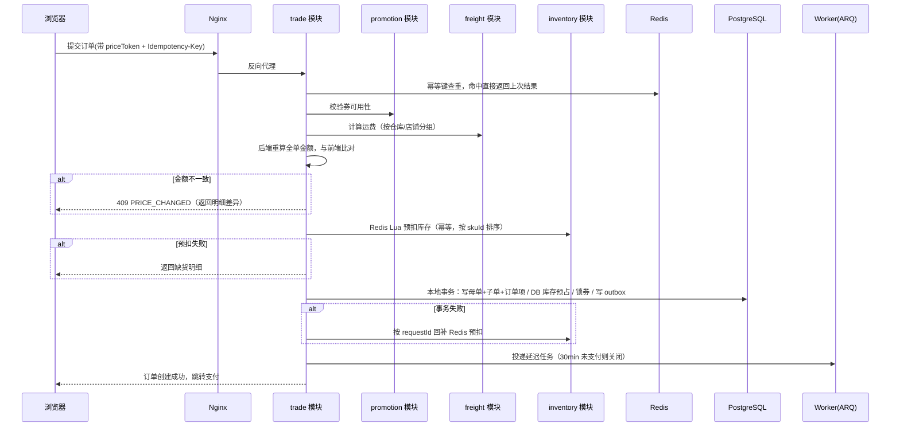

# 01 总体架构与模块划分

## 1. 业务范围

平台型电商（B2C + 多商家入驻），核心链路：

```
浏览商品 → 加购物车 → 结算（算价/算运费/用券）→ 提交订单 → 支付
   → 拆单 → 商家发货 → 收货 → 评价
                ↘ 售后（仅退款 / 退货退款）→ 退款 → 库存恢复 → 积分/券回退
```

**角色**：买家、商家（店铺）、平台运营、平台财务。
**核心实体**：SPU/SKU、购物车、订单（母单/子单）、支付单、退款单、优惠券、促销活动、运费模板、库存、积分、评价。

**前端应用**（第一期）：

| 应用 | 使用者 | 技术 |
|---|---|---|
| `web-mall` 买家 PC 商城 | 买家 | Vue 3 + Vite + TS + Element Plus + Pinia |
| `web-admin` 商家/运营后台 | 商家、平台运营、平台财务（按角色区分菜单与接口权限） | 同上 |

## 2. 模块划分

采用**模块化单体**：一个 FastAPI 应用，按**领域边界**分包，不按技术分层拆。每个模块独占自己的 PostgreSQL schema，模块之间只通过**模块的 service 接口**或**领域事件**通信，禁止跨模块直接读写对方的表。这样第一期只需部署一个应用，日后按模块拆服务时边界是现成的。

| 模块 | 职责 | 存储 | 关键难点 |
|---|---|---|---|
| **product** | SPU/SKU、类目、属性、上下架、商品搜索 | PG（`pg_trgm` 搜索） | SPU/SKU 建模、规格组合生成 |
| **inventory** | 可售库存、预占、扣减、回补、分仓 | Redis + PG | 防超发、排队削峰 |
| **cart** | 加购、选中、失效清理 | PG + Redis 缓存 | 价格快照、失效商品提示 |
| **promotion** | 优惠券模板、发券、核销、促销活动、算价 | PG + Redis | 券超发、复杂叠加、分摊 |
| **trade** | 结算页、订单创建、拆单、状态机 | PG | 拆单、状态一致性 |
| **freight** | 运费模板、区域、仓库、计费 | PG | 首重续重、冲突裁决 |
| **payment** | 支付单、渠道适配（第一期模拟渠道）、回调、对账 | PG | 回调幂等、对账补偿 |
| **aftersale** | 退款单、退货单、逆向状态机 | PG | 部分退、券与积分回退 |
| **user** | 账号、地址、积分账户、角色权限 | PG | 积分流水 |
| **review** | 评价、追评、图片、审核 | PG | 购后限制、唯一性 |
| **support** | 客服会话（买家 ↔ 商家 / 平台的异步工单） | PG + Redis | 一会话一仓、未读游标 |
| **assistant** | 后台 AI 助手（商家 / 平台的只读问答）+ **店小蜜**（买家侧：AI 以店铺身份答，见 [20 §14](20-assistant.md)） | PG + 外部模型 API | ★ 工具**只读**、身份服务端注入、答案靠轮询；店小蜜连发送方都是新的（`SENDER_AI`） |
| **settlement** | 商家账单、平台佣金 | PG | 对账准确性 |
| **notify** | 站内信（第一期不接短信） | PG | 幂等、去重 |

**模块依赖方向**（禁止反向依赖，用 `import-linter` 在 CI 中检查）：

```
trade ─┬─> inventory
       ├─> promotion
       ├─> freight
       ├─> product
       └─> cart

payment ──> trade
aftersale ─┬─> trade
           ├─> inventory
           ├─> promotion
           └─> user(积分)

support ─┬─> account（店铺名、买家标签）
         └─> notify（写站内信）

assistant ─┬─> trade / aftersale / inventory / freight / product / support（**只读**，取工具数据）
           └─> account（店铺归属与店铺名）

notify ──> （无下游；由 worker 的 outbox 投递循环与 support 调用）
```

★ **`assistant` 是唯一一个把跨模块编排放在 `service` 之外的地方**：它的入口不是 HTTP 而是
工具调用循环，所以编排落在 `tools.py` 的各个 handler 里（每个 handler 是个微型编排器），
`router.py` 只管助手自己的 HTTP。除此之外铁律不破 —— handler 只调对方 `service.py`。

★ **改动下面这些规则时要同步 `assistant/knowledge/`**（那是给模型看的）：后台那几篇
（`audience: staff` / `admin`）讲的是"怎么配"；**买家那篇**（`audience: buyer`）讲的是
"买家会问到的规则"（发货时效、七天无理由、运费的归属、退款流程）。两边的**受众是隔离的**
（见 [20 §14.7](20-assistant.md)）：
运费（[06](06-freight.md)）、仓库与发货路由（[03 §12](03-inventory.md)）、订单与售后（[07](07-order-and-split.md) / [08](08-aftersale.md)）、
商品审核、客服（[19](19-support.md)）。**拿旧规则答错的伤害大于不回答** —— 这是把知识库放仓库里而不是数据库里的唯一理由。

★ **`trade` / `payment` / `aftersale` 与 `notify` 之间没有边**：它们把通知意图写进
`core.local_message`（outbox，见 §2.2 与 docs/19 §4），由 worker 就地分派。这是
"不让下游模块反向依赖通知实现"的解耦缝 —— 站内信要换成短信时，改的是 worker 侧的
handler，不是那三个模块。

反向通知（如 payment 成功后 trade 改状态以外的副作用、inventory 回补后通知 product 刷新缓存）一律走领域事件。

### 2.1 后端代码结构

```
backend/
├── app/
│   ├── main.py                # FastAPI 实例、中间件、路由注册
│   ├── core/                  # 配置、数据库会话、Redis、雪花 ID、异常、鉴权
│   │   ├── config.py          # pydantic-settings，读环境变量
│   │   ├── db.py              # async engine / AsyncSession 工厂
│   │   ├── redis.py           # redis.asyncio 连接池 + Lua 脚本注册
│   │   ├── idempotency.py     # Idempotency-Key 依赖
│   │   └── outbox.py          # 本地消息表写入与投递
│   ├── modules/
│   │   ├── product/
│   │   │   ├── models.py      # SQLAlchemy ORM 模型
│   │   │   ├── schemas.py     # Pydantic 请求/响应模型
│   │   │   ├── repository.py  # 数据访问
│   │   │   ├── service.py     # 领域逻辑（对其他模块暴露的唯一入口）
│   │   │   └── router.py      # HTTP 路由
│   │   ├── inventory/ ...
│   │   └── trade/ ...
│   └── worker/
│       ├── main.py            # ARQ WorkerSettings：延迟任务 + cron
│       └── consumers.py       # Redis Streams 消费组
├── migrations/                # Alembic
├── lua/                       # Redis Lua 脚本
└── tests/
```

## 3. 分层与技术选型

```
接入层   Nginx（静态资源、反向代理、连接数/请求速率限制）
应用层   FastAPI + Uvicorn（多 worker）
          ├─ 鉴权（JWT，依赖注入 get_current_user）
          ├─ 限流（Redis 令牌桶，按用户/IP/接口）
          ├─ 幂等（Idempotency-Key 请求头依赖）
          └─ 统一异常 → 错误码响应
领域层   modules/*/service.py（订单、库存、券是聚合根）
基础设施  SQLAlchemy 2.0 async + asyncpg、redis-py asyncio、ARQ、Redis Streams
```

- **不需要分布式事务**。因为所有模块在同一个 PG 库，"创建订单 + DB 库存预占 + 锁券 + 写 outbox 消息"可以放在**一个本地事务**里。Redis 侧的预扣在事务前执行，事务失败则按幂等键补偿回滚。
- **读写分离（二期）**：第一期单实例 PG。上主从后，订单列表等读接口可走从库，但**下单前的库存校验与扣减必须走主库或 Redis**，不能读从库（复制延迟会导致超卖）。
- **async 纪律**：路由与 service 全部 `async def`，禁止在事件循环里调用阻塞 IO（`requests`、同步 `redis`、`time.sleep`）。CPU 密集的算价逻辑是纯内存计算，耗时在毫秒级，可直接执行。

## 4. 一致性策略总纲

### 4.1 三层防线

| 层 | 手段 | 作用 |
|---|---|---|
| 拦截层 | Redis Lua 原子脚本 | 挡住绝大多数无效请求，返回"已售罄" |
| 兜底层 | PG 条件更新 + `CHECK` 约束 + 唯一索引 | 保证绝对不超发，即使 Redis 异常 |
| 修正层 | 定时对账任务（ARQ cron） | 修正 Redis 与 DB 的漂移 |

### 4.2 库存超卖的三重保证

```sql
-- DB 侧：条件更新即乐观锁，rowcount = 0 就是扣减失败
UPDATE inventory.sku_stock
SET available = available - :num, version = version + 1
WHERE sku_id = :sku_id AND warehouse_id = :wh_id AND available >= :num;
```

再加一道表级约束 `CHECK (available >= 0 AND locked >= 0 AND frozen >= 0)`，任何代码 Bug 导致负库存都会让事务直接失败。

Redis 侧对应 Lua 脚本（见 [14-redis-keys](14-redis-keys.md)）。**两者都必须做**，因为：
- 只有 Redis：Redis 宕机或 AOF 丢最后一秒写入 → 超卖。
- 只有 DB：热点 SKU 单行锁打满，QPS 上不去。

### 4.3 幂等的三层保证

1. **接口层**：`Idempotency-Key` + Redis `SET NX`，5 分钟窗口。
2. **业务层**：状态机前置守卫（`status = 待支付` 才允许支付）。
3. **存储层**：唯一索引（`uk_order_no`、`uk_out_trade_no`、`uk_user_sku_review`），配合 `INSERT ... ON CONFLICT DO NOTHING`。

任何"写"接口必须至少有一层，资金类接口三层齐全。

## 5. 下单主流程时序



## 6. 关键字段透传：priceToken

前端提交订单时**必须**带上结算页返回的 `priceToken`：

```
priceToken = Base64(
    items_hash(排序后的 skuId:num:price 快照)
  + coupon_id + coupon_snap
  + freight_hash
  + expire_at
) + HMAC-SHA256(服务端密钥)
```

后端验签 + 验过期，然后**用它重算并对比**。作用：
1. 防止前端篡改价格；
2. 让"下单时价格已变"这类问题有明确错误码，而不是静默按新价下单；
3. 结算页 → 下单之间的时间差内，任何变动都能被检测到。

详见 [11-价格一致性](11-price-consistency.md)。

## 7. 流量治理

第一期部署在单台（或两台）CVM 上，容量目标比原方案小一个数量级，但治理手段保持一致，便于后续扩容。

| 手段 | 说明 |
|---|---|
| 静态资源 | 前端构建产物由 Nginx 直接提供，设置长缓存（文件名带 hash）；二期接 CDN |
| 前端防连点 | 按钮点击后立即置灰，请求结束再恢复（第一道防连点） |
| Nginx 限流 | `limit_req` 按 IP 限速，`limit_conn` 限连接数 |
| 应用限流 | Redis 令牌桶：用户维度 10 QPS、接口维度全局阈值 |
| 排队令牌 | 秒杀/抢券走 Redis 队列排队，拿到令牌才进入下单逻辑（[03](03-inventory.md)） |
| 库存分片 | 单 SKU 库存拆成 N 份 key，降低单 key 热点与 Lua 冲突 |
| 异步化 | 下单后的非关键路径（通知、积分、统计）全部走 outbox → Redis Streams |
| 降级开关 | 配置在 Redis 的 `switch:*` 键，运行时可切换（见 §10） |

## 8. 数据规模与分区规划

第一期**不分库分表**。PostgreSQL 单表在合理索引下支撑千万到亿级行没有问题，等真正遇到瓶颈再按 `user_id` 引入分片（Citus 或应用层路由）。为将来分片保留的约定：

- 订单、支付、售后表都带 `user_id` 字段，查询尽量带上它；
- 订单号内含时间位，可按时间路由。

大流水表用 **PG 声明式分区**（按月）控制单表体积，过期分区直接 `DETACH` + `DROP`：

| 表 | 分区方式 | 在线保留 |
|---|---|---|
| `inventory.stock_flow` | `created_at` 按月 RANGE 分区 | 6 个月 |
| `user.points_flow` | `created_at` 按月 RANGE 分区 | 2 年 |
| `payment.pay_notify_log` | `created_at` 按月 RANGE 分区 | 3 个月 |

**商家按店铺查订单**：单库下直接走 `order_sub (shop_id, status, created_at)` 索引，不需要原方案的 ES 异构索引。

## 9. 部署与容量

部署细节见 [16-deployment](16-deployment.md)。概要：

- 一台腾讯云 CVM（建议 4 核 8G 起，SSD 云硬盘），Docker Compose 运行 `nginx`、`api`、`worker`、`postgres`、`redis` 五个容器。
- `api` 无状态，可通过 `docker compose up --scale api=N` 水平扩展；`worker` 中 ARQ cron 任务需保证单实例或使用 ARQ 的任务唯一性。
- PostgreSQL、Redis 数据挂载到宿主机目录（云硬盘），每日 `pg_dump` 备份到另一块盘，并定期做云硬盘快照。
- Redis 开启 AOF（`appendfsync everysec`），重启后数据可恢复；即使丢失最后一秒，DB 对账会重建库存。

## 10. 容灾与降级矩阵

| 故障 | 影响 | 降级策略 |
|---|---|---|
| Redis 不可用 | 无法走库存闸门/领券/幂等 | 下单降级为 DB 条件更新直扣（应用层限流到 1/10）；领券暂停；幂等降级为 DB 唯一索引 |
| PostgreSQL 不可用 | 全站写失败 | 返回维护页；商品详情读 Redis 缓存 |
| Worker 进程挂掉 | 超时关单/消息投递延迟 | 进程由 Docker `restart: unless-stopped` 拉起；恢复后扫描任务补齐 |
| 营销模块异常 | 无法用券 | 允许"不使用优惠券"下单，结算页提示"优惠暂时不可用" |
| 支付渠道不可用 | 无法支付 | 展示"支付维护中"，已下单订单延长超时时间 |
| 对账任务失败 | 账目可能有偏差 | 对账任务可重跑（幂等），不影响线上交易 |

## 11. 非功能性目标（第一期，单台 4C8G）

| 指标 | 目标 |
|---|---|
| 下单接口 P99 | < 300ms |
| 结算页算价 P99 | < 200ms |
| 支付回调处理 P99 | < 100ms |
| 库存超卖 | 0（硬性指标，有对账告警） |
| 券超发 | 0（硬性指标） |
| 支付掉单率 | 由对账兜底到 0 |
| 峰值 | 下单 300 QPS，领券 2000 QPS（压测验证后再调整） |
