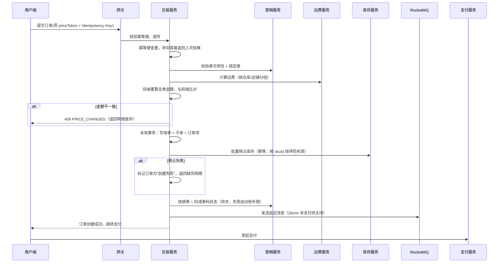

# 01 总体架构与领域划分

## 1. 业务范围

平台型电商（B2C + 多商家入驻），核心链路：

```
浏览商品 → 加购物车 → 结算（算价/算运费/用券）→ 提交订单 → 支付
   → 拆单 → 商家发货 → 收货 → 评价
                ↘ 售后（仅退款 / 退货退款）→ 退款 → 库存恢复 → 积分/券回退
```

**角色**：买家、商家（店铺）、平台运营、平台财务。
**核心实体**：SPU/SKU、购物车、订单（母单/子单）、支付单、退款单、优惠券、促销活动、运费模板、库存、积分、评价。

## 2. 服务划分

按**领域边界**拆服务，不按技术分层拆。每个服务独占自己的库，跨服务只通过接口或事件通信。

| 服务 | 职责 | 存储 | 关键难点 |
|---|---|---|---|
| **商品服务** product | SPU/SKU、类目、属性、上下架、商品搜索 | MySQL + ES | SPU/SKU 建模、规格组合生成 |
| **库存服务** inventory | 可售库存、预占、扣减、回补、分仓 | Redis + MySQL | 防超发、排队削峰 |
| **购物车服务** cart | 加购、选中、失效清理 | Redis + MySQL | 价格快照、失效商品提示 |
| **营销服务** promotion | 优惠券模板、发券、核销、促销活动、算价 | MySQL + Redis | 券超发、复杂叠加、分摊 |
| **交易服务** trade | 结算页、订单创建、拆单、状态机 | MySQL（分库分表） | 拆单、状态一致性 |
| **运费服务** freight | 运费模板、区域、仓库、计费 | MySQL | 首重续重、冲突裁决 |
| **支付服务** payment | 支付单、渠道对接、回调、对账 | MySQL | 回调幂等、对账补偿 |
| **售后服务** aftersale | 退款单、退货单、逆向状态机 | MySQL | 部分退、券与积分回退 |
| **用户服务** user | 账号、地址、积分账户 | MySQL | 积分流水 |
| **评论服务** review | 评价、追评、图片、审核 | MySQL + ES | 购后限制、唯一性 |
| **结算/分账** settlement | 商家账单、平台佣金、提现 | MySQL | 对账准确性 |
| **通知服务** notify | 短信/推送/站内信 | - | 幂等、去重 |

**服务依赖方向**（禁止反向依赖）：

```
trade ─┬─> inventory
       ├─> promotion
       ├─> freight
       ├─> product
       └─> cart

payment ──> trade
aftersale ─┬─> trade
           ├─> inventory
           ├─> promotion
           └─> user(积分)
```

## 3. 分层与技术选型

```
接入层   Nginx / API 网关（Spring Cloud Gateway）
          ├─ 鉴权（JWT）
          ├─ 限流（令牌桶 + 热点参数限流）
          ├─ 幂等键拦截器（Idempotency-Key 请求头）
          └─ 灰度路由
应用层   业务服务（Spring Boot 3 / Java 21）
领域层   聚合根 + 领域事件（订单、库存、券都是聚合根）
基础设施  MyBatis-Plus、Redis、RocketMQ、ES、Seata（仅少量场景）
```

- **不需要 Seata AT 全场覆盖**。绝大多数跨服务操作设计成"本地事务 + 事件 + 补偿"，只有"创建订单同时预占库存"这类需要立即反馈的场景，用本地消息表 + 库存服务的幂等预占接口实现最终一致。
- **读写分离**：订单、库存读走从库，但**下单前的库存校验与扣减必须走主库或 Redis**，不能读从库（延迟会导致超卖）。

## 4. 一致性策略总纲

### 4.1 三层防线

| 层 | 手段 | 作用 |
|---|---|---|
| 拦截层 | Redis Lua 原子脚本 | 挡住 99% 的无效请求，返回"已售罄" |
| 兜底层 | MySQL 条件更新 + 唯一索引 | 保证绝对不超发，即使 Redis 异常 |
| 修正层 | 定时对账任务 | 修正 Redis 与 DB 的漂移 |

### 4.2 库存超卖的三重保证

```sql
-- DB 侧：条件更新即乐观锁，RowsAffected=0 就是扣减失败
UPDATE sku_stock
SET available = available - #{num}, version = version + 1
WHERE sku_id = #{skuId} AND warehouse_id = #{whId} AND available >= #{num};
```

Redis 侧对应 `Lua` 脚本（见 [14-redis-keys](14-redis-keys.md)）。**两者都必须做**，因为：
- 只有 Redis：Redis 宕机/主从切换丢数据 → 超卖。
- 只有 DB：热点 SKU 单行锁打满，QPS 上不去。

### 4.3 幂等的三层保证

1. **网关/接口层**：`Idempotency-Key` + Redis `SETNX`，5 分钟窗口。
2. **业务层**：状态机前置守卫（`status = 待支付` 才允许支付）。
3. **存储层**：唯一索引（`uk_order_no`、`uk_out_trade_no`、`uk_user_sku_review`）。

任何"写"接口必须至少有一层，资金类接口三层齐全。

## 5. 下单主流程时序



## 6. 关键字段透传：priceToken

前端提交订单时**必须**带上结算页返回的 `priceToken`：

```
priceToken = Base64(
    items_hash(排序后的 skuId:num:price 快照)
  + coupon_id + coupon_snap
  + freight_hash
  + expire_at
) + HMAC-SHA256(服务端密钥)
```

后端验签 + 验过期，然后**用它重算并对比**。作用：
1. 防止前端篡改价格；
2. 让"下单时价格已变"这类问题有明确错误码，而不是静默按新价下单；
3. 结算页 → 下单之间的时间差内，任何变动都能被检测到。

详见 [11-价格一致性](11-price-consistency.md)。

## 7. 大促流量治理

| 手段 | 说明 |
|---|---|
| CDN + 静态化 | 商品详情页静态化到 CDN，只有价格/库存走动态接口 |
| 前端限流 | 按钮点击后立即置灰 3s，倒计时结束才可再点（第一道防连点） |
| 网关限流 | 用户维度 10 QPS、IP 维度 50 QPS、接口维度全局阈值 |
| 排队令牌 | 秒杀/抢券走令牌桶排队，拿到令牌才进入下单逻辑（[03](03-inventory.md)） |
| 库存分片 | 单 SKU 库存拆成 N 份，散列到不同 Redis 分片，降低单 key 热点 |
| 异步化 | 下单后的非关键路径（发券通知、积分、日志）全部走 MQ |
| 降级开关 | Redis 异常 → 关闭排队直接 DB 扣减（限流后）；DB 压力过大 → 关闭库存实时查询，展示"先到先得" |

## 8. 数据分片规划

| 表 | 分片键 | 预估量级 | 策略 |
|---|---|---|---|
| `order_main` / `order_sub` | `user_id` | 亿级 | 按 user_id 取模 64 库 × 16 表 |
| `order_item` | `order_sub_no`（同子单同库） | 十亿级 | 随子单 |
| `payment` | `order_main_no` | 亿级 | 随母单 |
| `refund_order` | `user_id` | 亿级 | 随母单 |
| `stock_flow` | `sku_id` + 月分区 | 百亿级 | 按时间月分区，归档到冷存储 |
| `coupon_code` | `coupon_template_id` | 十亿级 | 按模板分片 |
| `review` | `spu_id` | 亿级 | 按 spu_id 分片 |

**跨分片查询**：商家后台必须能按 `shop_id` 查订单（和 `user_id` 分片键冲突）→ 引入 **ES 异构索引**，订单变更时同步写入 ES，商家查询走 ES 拿 `order_no` 再回表。

## 9. 部署与容量

- 无状态服务：K8s 部署，HPA 按 CPU + QPS 弹性伸缩。
- Redis：Cluster 模式，6 主 6 从；库存 key 与券 key 单独放在同一集群的不同分片组，避免互相影响。
- MySQL：一主两从，主库只写；大促前预热连接池。
- MQ：至少 3 副本，延迟消息用独立的 topic。

## 10. 容灾与降级矩阵

| 故障 | 影响 | 降级策略 |
|---|---|---|
| Redis 集群不可用 | 无法下单/领券 | 排队降级为 DB 直接扣减（限流到 1/10 流量），非核心接口直接返回缓存 |
| 库存服务不可用 | 无法下单 | 订单进入"待确认库存"状态，先落单，异步补占；超时未占成功则自动取消 |
| 营销服务不可用 | 无法用券 | 允许"不使用优惠券"下单，结算页提示"优惠暂时不可用" |
| 支付网关不可用 | 无法支付 | 展示"支付维护中"，已下单订单延长超时时间 |
| MQ 不可用 | 异步链路中断 | 本地消息表落库，MQ 恢复后补偿投递 |
| 对账服务故障 | 账目可能有偏差 | 对账任务可重跑（幂等），不影响线上交易 |

## 11. 非功能性目标

| 指标 | 目标 |
|---|---|
| 下单接口 P99 | < 300ms（Redis 路径） |
| 结算页算价 P99 | < 200ms |
| 支付回调处理 P99 | < 100ms（异步化后） |
| 库存超卖 | 0（硬性指标，有监控告警） |
| 券超发 | 0（硬性指标） |
| 支付掉单率 | < 0.01%，由对账兜底到 0 |
| 大促峰值 | 下单 5000 QPS，领券 20000 QPS |
