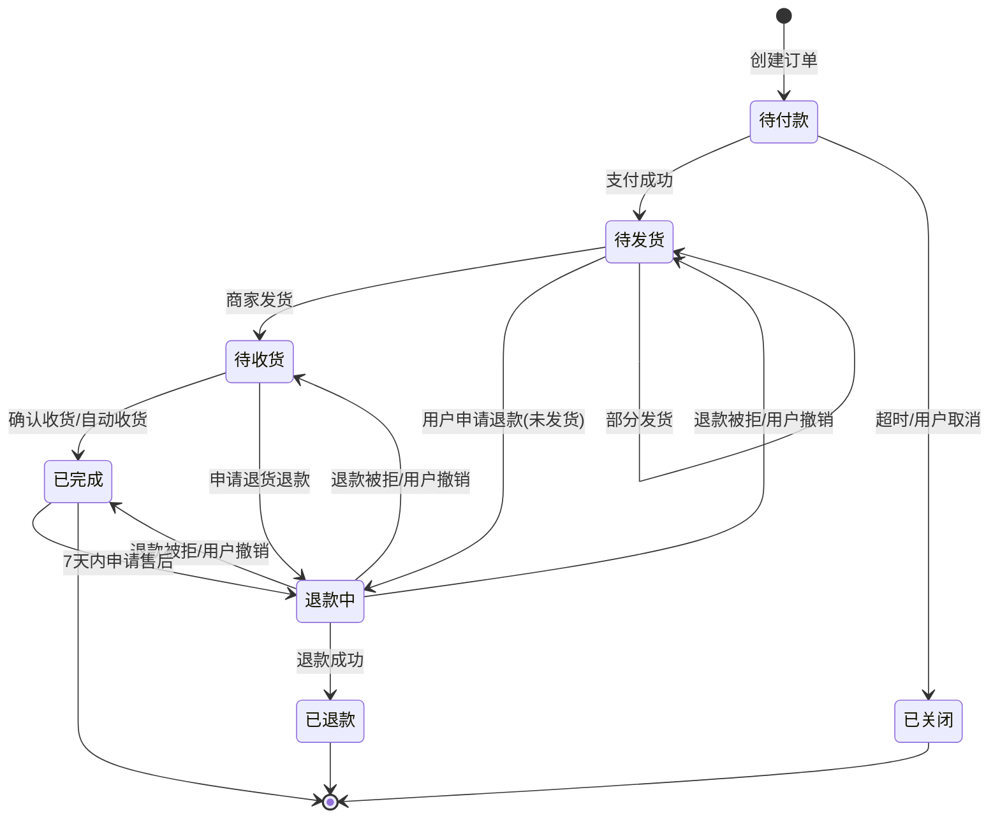

# 07 订单、拆单与状态机

## 1. 拆单的必然性

**跨店购买一个订单可能包含多个商家的货**，这带来几个必须解决的问题：

| 问题 | 不拆单的后果 |
|---|---|
| 发货 | 商家 A 无法操作包含商家 B 商品的订单 |
| 运费 | 不同商家/仓库，运费规则不同 |
| 退款 | 用户只退商家 A 的商品，无法定位 |
| 结算分账 | 平台无法把货款分给不同商家 |
| 状态 | 商家 A 已发货，商家 B 未发货，订单状态是唯一的一个值，表达不了 |

**方案：母子单模型**

```
   ┌──────────────────────────────┐
   │  母单 order_main              │  ← 用户看到的"一个订单"，支付单位
   │  order_main_no: M20260930001  │
   │  payable_amount: 358.00       │
   └───────────┬──────────────────┘
               │ 1 : N
     ┌─────────┴─────────┐
     ▼                   ▼
 ┌─────────────┐   ┌─────────────┐
 │ 子单 A       │   │ 子单 B       │  ← 商家/履约单位，状态独立流转
 │ shop_id: 100 │   │ shop_id: 200 │
 │ 仓库 WH-1    │   │ 仓库 WH-2    │
 │ 金额 200.00  │   │ 金额 158.00  │
 └──────┬──────┘   └──────┬──────┘
        ▼                 ▼
   ┌─────────┐       ┌─────────┐
   │ 订单项 1 │       │ 订单项 3 │  ← SKU 快照
   │ 订单项 2 │       │ 订单项 4 │
   └─────────┘       └─────────┘
```

**核心规则**：

1. **支付对象是母单**。用户只发起一次支付，金额是母单的 `payable_amount`。
2. **履约对象是子单**。每个子单有自己的状态机、发货单、物流单号。
3. **退款对象是子单**（或子单下的订单项）。退款金额从子单的金额里出。
4. **母单状态 = 所有子单状态的聚合**（见 §5）。

## 2. 拆单规则

### 2.1 拆单维度：按店铺

```
一次结算 → 按 shop_id 分组 → 每个店铺一个子单
```

**为什么按店铺而不是按仓库**：

| 维度 | 拆单粒度 | 问题 |
|---|---|---|
| 按仓库 | 更细 | 一个店铺的货可能在多个仓，会产生"同一店铺多个子单"，商家后台要合并看，反而复杂 |
| **按店铺** | ✅ | 与"商家自主发货"的履约模式对齐，商家后台天然是一个列表 |
| 按 SPU | 最细 | 一个订单可能几十个子单，用户体验差（订单列表爆炸） |

**按店铺拆单后，子单内部再按仓库拆"发货单"**：

```
子单 A（店铺 100）
  ├── 发货单 A-1（仓 WH-1）→ 物流单号 SF123
  └── 发货单 A-2（仓 WH-2）→ 物流单号 YT456
```

**发货单不进主订单表**，是子单内部的履约明细（`delivery_order` 表）。这样对用户展示友好（一个订单两件包裹），对商家操作清晰。第一期不对接 WMS 和快递接口，商家在后台手工填写快递公司和单号即视为发货。

### 2.2 拆单触发时机

**下单时拆**（而非支付后拆），理由：

1. 需要在创建子单时就确定各子单的金额分摊（否则支付后拆，金额一致性验证无从谈起）；
2. 库存预占按 SKU 做，与拆单无关，但**子单是库存预占的幂等粒度**；
3. 支付成功后直接推进各子单状态，无需二次拆单逻辑。

**副作用**：用户下单未支付就取消，会产生大量作废的母子单记录。解决：作废记录由归档任务处理（超过 3 个月的已关闭订单移入归档表，见 [13](13-schema.md) §7）。

### 2.3 拆单的字段分摊

每个字段都要归属于某个子单，且**母子单之间必须守恒**：

| 字段 | 母单 | 子单 |
|---|---|---|
| `total_amount`（商品原价） | Σ 子单 | = Σ 该店铺 items 的 item_amount |
| `item_discount`（单品促销） | Σ 子单 | = Σ 该店铺 items 的 item_discount |
| `shop_discount`（店铺级优惠） | Σ 子单 | 只归到命中的子单（店铺券天然属于一个店铺） |
| `platform_discount`（平台级优惠） | Σ 子单 | **按金额占比分摊**到各子单 |
| `point_deduction`（积分） | Σ 子单 | **按金额占比分摊** |
| `freight_amount` | Σ 子单 | 见 [06 §6](06-freight.md) 的运费分摊 |
| `payable_amount` | Σ 子单 | 计算得出 |

**分摊守恒检查**（下单时必须校验，失败则拒绝创建订单。不用 `assert`，因为 `python -O` 会移除它）：

```python
CONSERVED_FIELDS = (
    "total_amount", "item_discount", "shop_discount", "platform_discount",
    "point_deduction", "freight_amount", "payable_amount",
)

def assert_conservation(main: OrderMainDraft, subs: list[OrderSubDraft]) -> None:
    for field in CONSERVED_FIELDS:
        if getattr(main, field) != sum(getattr(s, field) for s in subs):
            raise PriceInvariantError(f"母子单 {field} 不守恒")
```

**平台优惠为什么要分摊到子单**：因为退款要按子单退。如果平台券 30 元不分摊，用户退掉子单 A（200 元）时，无法确定该退他多少钱。

### 2.4 拆单算法

```python
def split(calc: CalcResult) -> list[OrderSubDraft]:
    # ① 按店铺分组（dict 保持插入顺序，按商品在结算页的顺序出子单）
    by_shop: dict[int, list[ItemResult]] = defaultdict(list)
    for item in calc.items:
        by_shop[item.shop_id].append(item)

    # ② 该子单自身的优惠（天然归属，无需分摊）
    subs = [
        OrderSubDraft(
            shop_id=shop_id,
            items=items,
            total_amount=sum(i.unit_price * i.num for i in items),
            item_discount=sum(i.item_discount for i in items),
            shop_discount=sum(i.shop_discount for i in items),
        )
        for shop_id, items in by_shop.items()
    ]

    # ③ 平台级优惠/积分/平台券按金额占比分摊到子单（最大余数法，见 05 §6）
    #    运费已按包裹算好并归属到店铺（见 06 §6），直接取 calc 中的店铺运费
    base = [s.total_amount for s in subs]
    platform_alloc = allocate(calc.platform_discount, base)
    point_alloc = allocate(calc.point_deduction, base)
    platform_coupon_alloc = allocate(calc.platform_coupon_amount, base)

    for sub, plat, point, pcoupon in zip(subs, platform_alloc, point_alloc, platform_coupon_alloc):
        sub.platform_discount = plat
        sub.point_deduction = point
        sub.freight_amount = calc.freight_by_shop[sub.shop_id]
        sub.coupon_amount = calc.shop_coupon_by_shop.get(sub.shop_id, 0) + pcoupon
        sub.payable_amount = (sub.total_amount - sub.item_discount - sub.shop_discount
                              - sub.platform_discount - sub.point_deduction + sub.freight_amount)

    # ④ 守恒校验（失败直接抛异常，绝不写入不平的订单）
    assert_conservation(calc.as_main_draft(), subs)
    return subs
```

> 原方案中运费也按商品金额重新分摊到子单，这与 [06 §6](06-freight.md) "运费按包裹计算、同包裹多店铺时再分摊" 的规则冲突。这里统一以 06 为准：运费在 freight 模块中已归属到店铺，拆单时直接取用。

## 3. 表结构

DDL 约定见 [13-schema](13-schema.md) §0：`SMALLINT` 状态、`TIMESTAMPTZ(3)` 时间、行尾注释说明字段含义。

### 3.1 母单

```sql
CREATE TABLE trade.order_main (
  id                BIGINT       PRIMARY KEY,
  order_main_no     VARCHAR(32)  NOT NULL,          -- 母单号，见 §6
  user_id           BIGINT       NOT NULL,
  request_id        VARCHAR(160) NOT NULL,          -- 下单请求的幂等键（见 10 §5）
  shop_count        INT          NOT NULL DEFAULT 1, -- 包含的子单数
  -- 金额（含分摊汇总）
  total_amount      BIGINT       NOT NULL,          -- 商品原价总额
  item_discount     BIGINT       NOT NULL DEFAULT 0,
  shop_discount     BIGINT       NOT NULL DEFAULT 0,
  platform_discount BIGINT       NOT NULL DEFAULT 0,
  coupon_amount     BIGINT       NOT NULL DEFAULT 0, -- 券优惠总额（含店铺券+平台券），是上面各项的子集
  point_deduction   BIGINT       NOT NULL DEFAULT 0,
  point_used        INT          NOT NULL DEFAULT 0, -- 消耗积分
  freight_amount    BIGINT       NOT NULL DEFAULT 0,
  discount_amount   BIGINT GENERATED ALWAYS AS
      (item_discount + shop_discount + platform_discount + point_deduction) STORED,
  payable_amount    BIGINT       NOT NULL,          -- 应付 = total - 各优惠 + freight
  paid_amount       BIGINT       NOT NULL DEFAULT 0, -- 实付（支付回调写入）
  refunded_amount   BIGINT       NOT NULL DEFAULT 0, -- 累计已退
  -- 状态
  status            SMALLINT     NOT NULL DEFAULT 10, -- 见 §5 母单状态（与子单同一套编码）
  pay_status        SMALLINT     NOT NULL DEFAULT 0, -- 0未付 1已付 2部分退款 3全额退款
  -- 收货信息快照
  receiver_name     VARCHAR(64)  NOT NULL,
  receiver_phone    VARCHAR(20)  NOT NULL,
  receiver_province VARCHAR(32)  NOT NULL,
  receiver_city     VARCHAR(32)  NOT NULL,
  receiver_district VARCHAR(32)  NOT NULL,
  receiver_detail   VARCHAR(255) NOT NULL,
  region_code       VARCHAR(16)  NOT NULL,          -- 用于运费计算与统计
  freight_detail    JSONB        NOT NULL,          -- 运费计算明细快照（见 06 §12）
  -- 来源
  order_source      SMALLINT     NOT NULL DEFAULT 4, -- 第一期只有 4=PC
  buyer_remark      VARCHAR(255),
  -- 时间
  create_time       TIMESTAMPTZ(3) NOT NULL DEFAULT now(),
  pay_deadline      TIMESTAMPTZ(3) NOT NULL,        -- 支付截止（创建 + 30min）
  pay_time          TIMESTAMPTZ(3),
  finish_time       TIMESTAMPTZ(3),
  close_time        TIMESTAMPTZ(3),
  updated_at        TIMESTAMPTZ(3) NOT NULL DEFAULT now(),
  version           INT          NOT NULL DEFAULT 0,
  CONSTRAINT uk_order_main_no UNIQUE (order_main_no),
  -- ★ 金额守恒与退款上限由数据库兜底
  CONSTRAINT ck_main_payable CHECK (
    payable_amount = total_amount - item_discount - shop_discount
                   - platform_discount - point_deduction + freight_amount
    AND payable_amount >= 0),
  CONSTRAINT ck_main_refund CHECK (refunded_amount <= paid_amount)
);
CREATE INDEX idx_order_main_user ON trade.order_main (user_id, status, create_time DESC);
-- ★ 下单幂等的持久化兜底：Redis 幂等键丢失时仍能挡住重复下单
CREATE UNIQUE INDEX uk_order_main_request ON trade.order_main (user_id, request_id);
-- ★ 超时关单扫描：部分索引，只包含待付款订单，体积极小
CREATE INDEX idx_order_main_pay_deadline ON trade.order_main (pay_deadline) WHERE status = 10;
COMMENT ON TABLE trade.order_main IS '母单（支付与用户视角）';
```

### 3.2 子单

```sql
CREATE TABLE trade.order_sub (
  id                BIGINT       PRIMARY KEY,
  order_sub_no      VARCHAR(32)  NOT NULL,          -- 子单号，母单号 + "-" + 序号
  order_main_no     VARCHAR(32)  NOT NULL REFERENCES trade.order_main (order_main_no),
  user_id           BIGINT       NOT NULL,          -- 冗余，便于按用户查询
  shop_id           BIGINT       NOT NULL,
  shop_name_snap    VARCHAR(64)  NOT NULL,          -- 店铺名快照
  -- 金额（母单分摊后）
  total_amount      BIGINT       NOT NULL,
  item_discount     BIGINT       NOT NULL DEFAULT 0,
  shop_discount     BIGINT       NOT NULL DEFAULT 0,
  platform_discount BIGINT       NOT NULL DEFAULT 0,
  coupon_amount     BIGINT       NOT NULL DEFAULT 0,
  point_deduction   BIGINT       NOT NULL DEFAULT 0,
  freight_amount    BIGINT       NOT NULL DEFAULT 0,
  payable_amount    BIGINT       NOT NULL,
  refunded_amount   BIGINT       NOT NULL DEFAULT 0,
  -- ★ 状态机（见 §4）
  status            SMALLINT     NOT NULL DEFAULT 10, -- 10待付款 20待发货 30待收货 40已完成 50已关闭 60退款中 70已退款
  -- 履约
  delivery_status   SMALLINT     NOT NULL DEFAULT 0, -- 0未发货 1部分发货 2全部发货 3已签收
  delivery_count    INT          NOT NULL DEFAULT 0,
  -- 售后
  has_aftersale     BOOLEAN      NOT NULL DEFAULT false, -- 是否有进行中的售后
  can_aftersale     BOOLEAN      NOT NULL DEFAULT true,  -- 是否可申请售后
  -- 评价
  is_reviewed       BOOLEAN      NOT NULL DEFAULT false,
  -- 时间
  create_time       TIMESTAMPTZ(3) NOT NULL DEFAULT now(),
  deliver_time      TIMESTAMPTZ(3),
  receive_time      TIMESTAMPTZ(3),
  finish_time       TIMESTAMPTZ(3),
  close_time        TIMESTAMPTZ(3),
  auto_finish_time  TIMESTAMPTZ(3),                 -- 自动确认收货时间
  updated_at        TIMESTAMPTZ(3) NOT NULL DEFAULT now(),
  version           INT          NOT NULL DEFAULT 0,
  CONSTRAINT uk_order_sub_no UNIQUE (order_sub_no),
  CONSTRAINT ck_sub_payable CHECK (
    payable_amount = total_amount - item_discount - shop_discount
                   - platform_discount - point_deduction + freight_amount
    AND payable_amount >= 0),
  CONSTRAINT ck_sub_refund CHECK (refunded_amount <= payable_amount)
);
CREATE INDEX idx_order_sub_main ON trade.order_sub (order_main_no);
CREATE INDEX idx_order_sub_user ON trade.order_sub (user_id, status, create_time DESC);
-- 商家后台主查询（单库下直接走索引，不需要 ES）
CREATE INDEX idx_order_sub_shop ON trade.order_sub (shop_id, status, create_time DESC);
-- 自动收货扫描：部分索引
CREATE INDEX idx_order_sub_auto_finish ON trade.order_sub (auto_finish_time) WHERE status = 30;
COMMENT ON TABLE trade.order_sub IS '子单（商家履约视角）';
```

> 母单、子单、订单项同属 `trade` schema，可以建外键；跨模块（如 `payment.payment.order_main_no`）不建外键，见 [13](13-schema.md) §0。

### 3.3 发货单（子单内按仓库拆）

```sql
CREATE TABLE trade.delivery_order (
  id               BIGINT      PRIMARY KEY,
  delivery_no      VARCHAR(32) NOT NULL,
  order_sub_no     VARCHAR(32) NOT NULL REFERENCES trade.order_sub (order_sub_no),
  order_main_no    VARCHAR(32) NOT NULL,
  shop_id          BIGINT      NOT NULL,
  warehouse_id     BIGINT      NOT NULL,
  express_company  VARCHAR(32) NOT NULL,     -- 快递公司编码
  express_no       VARCHAR(64) NOT NULL,     -- 物流单号
  status           SMALLINT    NOT NULL DEFAULT 1, -- 1待发货 2已发货 3已签收
  deliver_time     TIMESTAMPTZ(3),
  receive_time     TIMESTAMPTZ(3),
  created_at       TIMESTAMPTZ(3) NOT NULL DEFAULT now(),
  CONSTRAINT uk_delivery_no UNIQUE (delivery_no),
  CONSTRAINT uk_delivery_express UNIQUE (express_company, express_no)
);
CREATE INDEX idx_delivery_sub ON trade.delivery_order (order_sub_no);
COMMENT ON TABLE trade.delivery_order IS '发货单';

-- 发货单与订单项的多对多（一个订单项可能分多次发货）
CREATE TABLE trade.delivery_item (
  id            BIGINT GENERATED ALWAYS AS IDENTITY PRIMARY KEY,
  delivery_no   VARCHAR(32) NOT NULL REFERENCES trade.delivery_order (delivery_no),
  order_item_id BIGINT      NOT NULL REFERENCES trade.order_item (id),
  num           INT         NOT NULL CHECK (num > 0),
  CONSTRAINT uk_delivery_item UNIQUE (delivery_no, order_item_id)
);
```

## 4. 子单状态机（核心）

### 4.1 状态定义

| 状态码 | 名称 | 含义 | 可执行操作 |
|---|---|---|---|
| 10 | 待付款 | 订单已创建，等待支付 | 支付、取消 |
| 20 | 待发货 | 已支付，等待商家发货 | 商家发货、申请退款 |
| 30 | 待收货 | 已发货，等待用户确认 | 确认收货、查物流、申请售后 |
| 40 | 已完成 | 交易完成 | 评价、申请售后（7天内） |
| 50 | 已关闭 | 取消/超时关闭 | 无 |
| 60 | 退款中 | 售后处理中 | 撤销申请 |
| 70 | 已退款 | 退款完成 | 无 |

### 4.2 状态流转图



### 4.3 状态机实现：表驱动而非 if-else

```python
# app/modules/trade/state_machine.py
class SubOrderStatus(IntEnum):
    WAIT_PAY = 10
    WAIT_DELIVER = 20
    WAIT_RECEIVE = 30
    FINISHED = 40
    CLOSED = 50
    REFUNDING = 60
    REFUNDED = 70


class OrderEvent(StrEnum):
    PAY_SUCCESS = "PAY_SUCCESS"
    USER_CANCEL = "USER_CANCEL"
    TIMEOUT_CANCEL = "TIMEOUT_CANCEL"
    SHIP = "SHIP"
    PARTIAL_SHIP = "PARTIAL_SHIP"
    CONFIRM_RECEIVE = "CONFIRM_RECEIVE"
    AUTO_RECEIVE = "AUTO_RECEIVE"
    APPLY_REFUND = "APPLY_REFUND"
    APPLY_AFTERSALE = "APPLY_AFTERSALE"
    REFUND_SUCCESS = "REFUND_SUCCESS"
    REFUND_REJECT = "REFUND_REJECT"
    USER_REVOKE = "USER_REVOKE"


S, E = SubOrderStatus, OrderEvent

# ★ 状态机定义：当前状态 → 允许的事件 → 目标状态
# 目标为 None 表示"恢复到售后单记录的 source_status"（见下方说明）
TRANSITIONS: dict[SubOrderStatus, dict[OrderEvent, SubOrderStatus | None]] = {
    S.WAIT_PAY: {
        E.PAY_SUCCESS: S.WAIT_DELIVER,
        E.USER_CANCEL: S.CLOSED,
        E.TIMEOUT_CANCEL: S.CLOSED,
    },
    S.WAIT_DELIVER: {
        E.SHIP: S.WAIT_RECEIVE,
        E.PARTIAL_SHIP: S.WAIT_DELIVER,
        E.APPLY_REFUND: S.REFUNDING,
    },
    S.WAIT_RECEIVE: {
        E.CONFIRM_RECEIVE: S.FINISHED,
        E.AUTO_RECEIVE: S.FINISHED,
        E.APPLY_REFUND: S.REFUNDING,
    },
    S.FINISHED: {
        E.APPLY_AFTERSALE: S.REFUNDING,
    },
    S.REFUNDING: {
        E.REFUND_SUCCESS: S.REFUNDED,
        E.REFUND_REJECT: None,      # 拒绝后退回原状态
        E.USER_REVOKE: None,        # 撤销后退回原状态
    },
}
```

**`REFUND_REJECT` 的目标状态取决于"从哪来的"**。20→60 和 30→60 拒绝后应该回到各自的原状态。解决方案：**在售后单上记录 `source_status`**（见 [13](13-schema.md) §3），拒绝/撤销时由调用方通过 `ctx.restore_to` 传入。

```python
# aftersale 模块，商家拒绝时
await trade_service.transit(
    session, refund.order_sub_no, OrderEvent.REFUND_REJECT,
    TransitContext(operator=merchant, restore_to=SubOrderStatus(refund.source_status)),
)
```

### 4.4 状态变更的统一入口（关键设计）

**所有状态变更必须走同一个函数**，禁止任何地方直接 `UPDATE trade.order_sub SET status = ...`（code review 与 `grep` 检查）。

```python
async def transit(session: AsyncSession, order_sub_no: str, event: OrderEvent,
                  ctx: TransitContext) -> SubOrderStatus:
    """在调用方的事务内执行状态流转。"""
    # ① 加行锁读取当前状态（悲观锁，防止并发状态变更）
    sub = await session.scalar(
        select(OrderSub).where(OrderSub.order_sub_no == order_sub_no).with_for_update()
    )
    if sub is None:
        raise BizError(ErrorCode.ORDER_NOT_FOUND)
    from_status = SubOrderStatus(sub.status)

    # ② 状态机校验：非法流转直接拒绝
    allowed = TRANSITIONS.get(from_status, {})
    if event not in allowed:
        raise IllegalTransitionError(order_sub_no, from_status, event)
    to_status = allowed[event] or ctx.restore_to
    if to_status is None:
        raise IllegalTransitionError(order_sub_no, from_status, event, "缺少 restore_to")

    # ③ CAS 更新（double check，防并发）
    result = await session.execute(
        update(OrderSub)
        .where(OrderSub.order_sub_no == order_sub_no, OrderSub.status == from_status)
        .values(status=to_status, updated_at=func.now(), version=OrderSub.version + 1)
    )
    if result.rowcount == 0:
        raise ConcurrentStateChangeError(order_sub_no)

    # ④ 写状态流水（审计）
    session.add(OrderStateFlow(order_type=2, order_no=order_sub_no, from_status=from_status,
                               to_status=to_status, event=event, **ctx.audit_fields()))

    # ⑤ 写 outbox 事件（与状态变更同一事务提交，异步处理副作用：通知、积分、销量统计）
    await outbox.add(session, topic="trade.sub_status_changed", biz_key=f"{order_sub_no}:{sub.version + 1}",
                     payload={"orderSubNo": order_sub_no, "from": from_status, "to": to_status, "event": event})

    # ⑥ 聚合母单状态
    await aggregate_main_order(session, sub.order_main_no)
    return to_status
```

对应 SQL：

```sql
-- CAS 更新：只有当前状态等于预期值才更新
UPDATE trade.order_sub
SET status = :to, updated_at = now(), version = version + 1
WHERE order_sub_no = :sub_no AND status = :from;
```

**三重保护**：`SELECT ... FOR UPDATE`（行锁）→ 状态机查表（业务校验）→ `WHERE status = :from`（CAS）。任一层失效，其他层仍能拦住。

> 事务边界由**会话依赖**统一管理（`app/core/db.py` 的 `get_session`）：一个请求一个事务，成功提交、异常回滚。路由和 service 都不自己 `begin()` / `commit()`。
>
> 为什么不让路由写 `async with session.begin()`：依赖（如"取当前店铺"）也会查库，SQLAlchemy 的 autobegin 会先把事务开起来，路由再 `begin()` 就会抛 `A transaction is already begun`。把事务边界收到会话依赖这一层，路由和依赖都能自由读写同一个事务。
>
> 需要在**主事务之外**独立提交的场景（例如"写完审计记录后立刻抛异常"，或后台任务），显式用 `async with get_session_factory()() as session, session.begin():` 另起一个事务 —— 见 [10 §3](#) 与 `account` 模块的登录失败计数。

### 4.5 状态流水表

```sql
CREATE TABLE trade.order_state_flow (
  id            BIGINT GENERATED ALWAYS AS IDENTITY PRIMARY KEY,
  order_type    SMALLINT    NOT NULL,      -- 1母单 2子单 3售后单
  order_no      VARCHAR(32) NOT NULL,
  from_status   SMALLINT    NOT NULL,
  to_status     SMALLINT    NOT NULL,
  event         VARCHAR(32) NOT NULL,
  operator_type SMALLINT    NOT NULL,      -- 1用户 2商家 3系统 4平台客服
  operator_id   VARCHAR(64),
  remark        VARCHAR(255),
  extra         JSONB,                     -- 上下文快照
  created_at    TIMESTAMPTZ(3) NOT NULL DEFAULT now()
);
CREATE INDEX idx_state_flow_order ON trade.order_state_flow (order_no, created_at);
COMMENT ON TABLE trade.order_state_flow IS '订单状态流转流水（审计）';
```

**这张表是不可变的审计日志**。纠纷时可以直接还原订单的完整生命历史。应用使用的数据库账号对这张表只授予 `INSERT, SELECT` 权限（见 [16](16-deployment.md) §4），从权限层面保证不可改。

## 5. 母单状态的聚合

母单状态由子单聚合得出，规则：

```python
def aggregate(statuses: set[SubOrderStatus]) -> SubOrderStatus:
    if len(statuses) == 1:
        return next(iter(statuses))          # 全部同状态（含全完成/全关闭/全退款）

    # 混合情况：按"最落后"的状态展示（用户视角：还有事情没做完）
    for s in (S.WAIT_PAY, S.WAIT_DELIVER, S.WAIT_RECEIVE, S.REFUNDING, S.FINISHED):
        if s in statuses:
            return s                          # FINISHED 对应"部分完成、其余关闭/已退款"
    # 只剩 CLOSED 与 REFUNDED 的组合
    return S.REFUNDED if S.REFUNDED in statuses else S.CLOSED
```

**"部分退款"的展示**：子单 A 已退款、子单 B 待收货时，母单显示"待收货"，并在订单卡片上标注"1 件商品已退款"。这是**展示层的组合**，不改变母单的单一状态字段。

**母单 `pay_status` 单独维护**（因为它和履约状态是正交的）：

| pay_status | 含义 |
|---|---|
| 0 | 未支付 |
| 1 | 已支付 |
| 2 | 部分退款 |
| 3 | 全额退款 |

## 6. 订单号设计

```
母单号：M + yyyyMMdd + 雪花 ID 后 10 位 + 校验位(1位)
        M 20260930 3847192637 7
        总长 1+8+10+1 = 20 位

子单号：母单号 + "-" + 序号
        M2026093038471926377-1
```

**日期前缀**：排查问题时从订单号就能知道下单日期，按时间分区或归档时可以直接路由。原方案中的"分片号"位因为第一期不分库分表而去掉；若日后分片，可在日期后插入 2 位分片号，号段长度预留到 32 位（字段为 `VARCHAR(32)`）。

**校验位**：Luhn 算法，防止用户手输错订单号查出别人的订单（配合登录态校验归属）。

**不能用自增 ID 暴露给前端**：自增 ID 会泄露业务量（竞争对手下两单就能估算日单量）。用雪花或带日期的自定义号。

## 7. 订单超时关闭

**双重机制**：

### 7.1 ARQ 延迟任务（主）

```python
# 下单事务提交之后投递（事务内投递会导致"事务回滚了任务还在"）
await arq_pool.enqueue_job(
    "close_order_if_unpaid",
    order_main_no,
    _job_id=f"close:{order_main_no}",        # ★ 同一订单只会有一个任务（ARQ 按 job_id 去重）
    _defer_until=pay_deadline,               # 到期时间执行
)
```

Worker 中的任务：

```python
# app/worker/tasks.py
async def close_order_if_unpaid(ctx: dict, order_main_no: str) -> None:
    async with ctx["session_factory"]() as session, session.begin():
        # ★ 幂等 + 状态检查：只有还是"待付款"才关闭
        await order_service.close_order(session, order_main_no, CloseReason.TIMEOUT)
```

```sql
-- 关闭（CAS，天然幂等）
UPDATE trade.order_main SET status = 50, close_time = now(), updated_at = now()
WHERE order_main_no = :no AND status = 10;
-- rowcount = 0 → 说明已支付或已关闭，直接返回（这就是幂等）
```

### 7.2 定时扫描（兜底）

ARQ 任务存在 Redis 中，Redis 数据丢失或 worker 长时间宕机都可能导致任务丢失。兜底扫描：

```python
# ARQ cron：每 2 分钟
async def scan_timeout_orders(ctx: dict) -> None:
    async with ctx["session_factory"]() as session:
        # 命中部分索引 idx_order_main_pay_deadline，每次扫 500 条
        overdue = (await session.scalars(
            select(OrderMain.order_main_no)
            .where(OrderMain.status == 10, OrderMain.pay_deadline < func.now())
            .order_by(OrderMain.pay_deadline)
            .limit(500)
        )).all()

    for no in overdue:
        try:
            async with ctx["session_factory"]() as session, session.begin():
                await order_service.close_order(session, no, CloseReason.TIMEOUT)  # 同一个幂等函数
        except Exception:
            logger.exception("超时关单失败", order_main_no=no)

# WorkerSettings.cron_jobs = [cron(scan_timeout_orders, minute=set(range(0, 60, 2)), unique=True)]
```

**两个路径调用同一个幂等函数**，所以重复执行无副作用。这是"幂等设计让容错变简单"的典型例子。

### 7.3 关单的完整动作

模块化单体中，大部分关单动作可以放进**同一个本地事务**，只有 Redis 侧的回补和通知需要异步：

```python
async def close_order(session: AsyncSession, order_main_no: str, reason: CloseReason) -> None:
    # ① CAS 关母单
    main = await order_repo.close_main_if_unpaid(session, order_main_no, reason)
    if main is None:
        return                                                    # 已被处理

    # ② 关闭所有子单（走统一状态机入口）
    subs = await order_repo.list_subs(session, order_main_no)
    event = OrderEvent.TIMEOUT_CANCEL if reason is CloseReason.TIMEOUT else OrderEvent.USER_CANCEL
    for sub in subs:
        await transit(session, sub.order_sub_no, event, TransitContext.system())

    # ③ 释放 DB 库存预占（同一事务，biz_key 幂等）
    await inventory_service.release(session, build_release_items(subs), biz_key=f"CANCEL:{order_main_no}")

    # ④ 解锁优惠券、⑤ 退回积分（同一事务，条件更新天然幂等）
    await coupon_service.unlock_by_order(session, order_main_no)
    await points_service.refund_frozen(session, main.user_id, order_main_no, main.point_used)

    # ⑥ 需要异步的副作用写 outbox：Redis 库存回补、站内信通知
    await outbox.add(session, topic="inventory.redis_release", biz_key=f"CANCEL:{order_main_no}",
                     payload={"orderMainNo": order_main_no})
    await outbox.add(session, topic="notify.order_closed", biz_key=f"CLOSED:{order_main_no}",
                     payload={"userId": main.user_id, "orderMainNo": order_main_no})
```

**为什么 Redis 回补不放事务里**：Redis 操作无法随 PG 事务回滚。如果先回补 Redis 再提交事务，事务失败时 Redis 已经多出库存（超卖风险）。写 outbox 能保证"事务提交 ⇔ 回补消息存在"，由投递任务异步执行，失败重试，Lua 脚本按 `biz_key` 幂等（见 [14](14-redis-keys.md)）。

本地消息表（outbox）的结构与投递机制见 [13 §4](13-schema.md)。

## 8. 自动确认收货

```python
# ARQ cron：每 10 分钟
async def auto_receive(ctx: dict) -> None:
    async with ctx["session_factory"]() as session:
        # 发货后 15 天自动确认（命中部分索引 idx_order_sub_auto_finish）
        due = (await session.scalars(
            select(OrderSub.order_sub_no)
            .where(OrderSub.status == 30, OrderSub.auto_finish_time < func.now())
            .limit(500)
        )).all()

    for no in due:
        async with ctx["session_factory"]() as session, session.begin():
            await transit(session, no, OrderEvent.AUTO_RECEIVE, TransitContext.system())
```

**自动收货后的副作用**（通过 outbox 事件触发，全部幂等）：
- 触发结算（`settlement`）：货款解冻，进入可提现余额
- 开启售后窗口（签收后 7 天）
- 开启评价入口

## 9. 变更订单信息的边界

**绝对原则：订单创建后，以下字段永不可变**

| 字段 | 不可变的理由 |
|---|---|
| 所有金额字段 | 涉及资金，变更即对账不平 |
| `order_item` 的所有 `_snap` 字段 | 是契约的一部分 |
| SKU、数量 | 变更相当于另一个订单 |
| 收货地址 | 发货后改地址会导致包裹丢失；**发货前可改**，但需重新校验运费并改子单 |

**发货前改地址的流程**：

```
1. 校验子单状态 ∈ {待发货}
2. 校验新地址是否在配送范围（freight 模块）
3. 重算运费
   - 运费不变 → 直接更新
   - 运费变高 → 第一期直接拒绝，提示"新地址运费更高，请取消后重新下单"
   - 运费变低 → 直接更新，差价不退（第一期简化）
4. 更新收货快照 + 记录状态流水
```

**改价绝对禁止**。需要改价时，取消原订单（退款）+ 新建订单。这是保护数据一致性的硬约束。

## 10. 订单查询的多维度问题

第一期单库，所有维度都直接走 PG 索引：

| 查询方 | 维度 | 方案 |
|---|---|---|
| 用户 | `user_id` | `idx_order_sub_user (user_id, status, create_time DESC)` |
| 商家 | `shop_id` | `idx_order_sub_shop (shop_id, status, create_time DESC)` |
| 平台运营 | 任意维度 | 后台报表查询；数据量大后加只读从库或导出到分析库 |
| 客服 | 订单号 | 唯一索引直接定位 |

**分页**：订单列表用**游标分页**（`WHERE (create_time, id) < (:last_time, :last_id) ORDER BY create_time DESC, id DESC LIMIT 20`），避免深分页 `OFFSET` 越翻越慢。

**收货手机号查询**（客服场景）：手机号脱敏存储，按 `phone_hash` 精确匹配，见 [13 §2](13-schema.md)。

## 11. 边界场景清单

| 场景 | 处理 |
|---|---|
| 母单只有 1 个子单 | 仍然创建母子单（统一模型，避免两套逻辑）。展示层直接展开子单内容 |
| 支付时某个子单的商品下架 | 不影响，已下单订单读快照 |
| 用户只对子单 A 申请退款，子单 B 正常 | 子单独立处理，母单 `pay_status` 变更为 2（部分退款） |
| 所有子单都退款了 | 母单 `pay_status = 3`，`status = 70` |
| 商家超时未发货（承诺 48h） | 定时任务生成站内信提醒 + 运营后台告警列表 |
| 用户取消订单时已发货 | 拒绝，提示"已发货，请申请退货退款" |
| 同一母单下某子单退款导致母单金额变小 | 母单 `payable_amount` **不变**（它是历史事实），只有 `refunded_amount` 累加 |
| 关单时 Redis 回补失败 | outbox 重试，最终一致。用户看到订单已关闭 |
| 用户支付后立刻申请退款（未发货） | 允许，走"仅退款"流程，全额退子单金额 |
| 订单已完成后 8 天申请售后 | 拒绝，超过 7 天窗口（`can_aftersale = false`） |

## 12. 订单状态与售后的耦合

**`order_sub.status` 与售后单状态是两套状态机**，通过规则关联（售后单状态码见 [08 §3.1](08-aftersale.md)）：

```
order_sub.status = 60 (退款中)  ←→  refund_order.status ∈ 处理中的状态（10/20/30/40/50/60/90）
order_sub.status = 70 (已退款)  ←→  refund_order.status = 70 退款成功
order_sub.status = 20/30/40     ←→  refund_order.status ∈ {11 商家拒绝, 80 已关闭, 81 用户撤销}
```

**必须保证两者同步**。模块化单体中，售后单状态变更与子单状态变更**在同一个事务里完成**：aftersale 模块在更新售后单的同一事务中调用 `trade_service.transit(...)`，任何一步失败整体回滚，不存在"一边改了另一边没改"的窗口。

```python
# aftersale 模块：退款成功（由 payment 模块的退款回调触发）
# 事务由会话依赖统一管理，两处写在同一个事务里，任何一步失败整体回滚
await refund_repo.mark_success(session, refund_no)                 # 售后单 → 70
await trade_service.transit(session, refund.order_sub_no,
                            OrderEvent.REFUND_SUCCESS, ctx)         # 子单 60 → 70
```

**对账兜底**：即便如此，仍保留每日对账 SQL，用来发现代码 Bug 导致的不一致：

```sql
-- 每天扫描：售后单已成功但子单还是退款中
SELECT r.refund_no, r.order_sub_no
FROM aftersale.refund_order r
JOIN trade.order_sub s ON r.order_sub_no = s.order_sub_no
WHERE r.status = 70 /*退款成功*/ AND s.status = 60 /*退款中*/
  AND r.refund_time < now() - INTERVAL '10 minutes';
-- 必须为空；有结果则告警并人工处理
```
