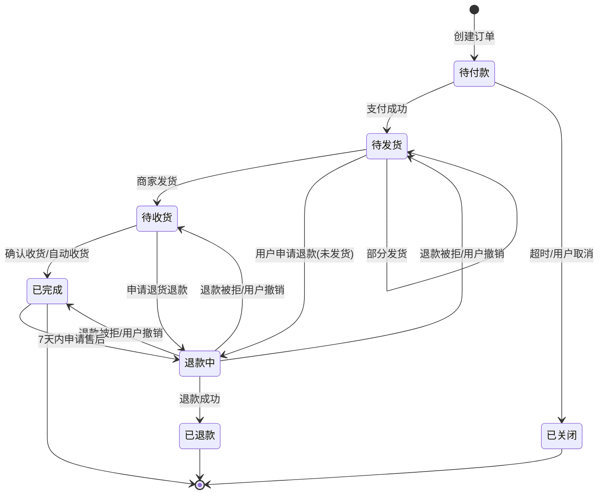

# 07 订单、拆单与状态机

## 1. 拆单的必然性

**跨店购买一个订单可能包含多个商家的货**，这带来四个必须解决的问题：

| 问题 | 不拆单的后果 |
|---|---|
| 发货 | 商家 A 无法操作包含商家 B 商品的订单 |
| 运费 | 不同商家/仓库，运费规则不同 |
| 退款 | 用户只退商家 A 的商品，无法定位 |
| 结算分账 | 平台无法把货款分给不同商家 |
| 状态 | 商家 A 已发货，商家 B 未发货，订单状态是唯一的一个值，表达不了 |

**方案：母子单模型**

```
   ┌──────────────────────────────┐
   │  母单 order_main              │  ← 用户看到的"一个订单"，支付单位
   │  order_main_no: M20260930001  │
   │  payable_amount: 358.00       │
   └───────────┬──────────────────┘
               │ 1 : N
     ┌─────────┴─────────┐
     ▼                   ▼
 ┌─────────────┐   ┌─────────────┐
 │ 子单 A       │   │ 子单 B       │  ← 商家/履约单位，状态独立流转
 │ shop_id: 100 │   │ shop_id: 200 │
 │ 仓库 WH-1    │   │ 仓库 WH-2    │
 │ 金额 200.00  │   │ 金额 158.00  │
 └──────┬──────┘   └──────┬──────┘
        ▼                 ▼
   ┌─────────┐       ┌─────────┐
   │ 订单项 1 │       │ 订单项 3 │  ← SKU 快照
   │ 订单项 2 │       │ 订单项 4 │
   └─────────┘       └─────────┘
```

**核心规则**：

1. **支付对象是母单**。用户只发起一次支付，金额是母单的 `payable_amount`。
2. **履约对象是子单**。每个子单有自己的状态机、发货单、物流单号。
3. **退款对象是子单**（或子单下的订单项）。退款金额从子单的金额里出。
4. **母单状态 = 所有子单状态的聚合**（见 §5）。

## 2. 拆单规则

### 2.1 拆单维度：按店铺

```
一次结算 → 按 shop_id 分组 → 每个店铺一个子单
```

**为什么按店铺而不是按仓库**：

| 维度 | 拆单粒度 | 问题 |
|---|---|---|
| 按仓库 | 更细 | 一个店铺的货可能在多个仓，会产生"同一店铺多个子单"，商家后台要合并看，反而复杂 |
| **按店铺** | ✅ | 与"商家自主发货"的履约模式对齐，商家后台天然是一个列表 |
| 按 SPU | 最细 | 一个订单可能几十个子单，用户体验差（订单列表爆炸） |

**按店铺拆单后，子单内部再按仓库拆"发货单"**：

```
子单 A（店铺 100）
  ├── 发货单 A-1（仓 WH-1）→ 物流单号 SF123
  └── 发货单 A-2（仓 WH-2）→ 物流单号 YT456
```

**发货单不进主订单表**，是子单内部的履约明细（`delivery_order` 表）。这样对用户展示友好（一个订单两件包裹），对商家操作清晰。

### 2.2 拆单触发时机

**下单时拆**（而非支付后拆），理由：

1. 需要在创建子单时就确定各子单的金额分摊（否则支付后拆，金额一致性验证无从谈起）；
2. 库存预占按 SKU 做，与拆单无关，但**子单是库存预占的幂等粒度**；
3. 支付成功后直接推进各子单状态，无需二次拆单逻辑。

**副作用**：用户下单未支付就取消，会产生大量作废的母子单记录。解决：订单表按 `user_id` 分片，作废记录由归档任务处理（超过 3 个月的已关闭订单归档到冷库）。

### 2.3 拆单的字段分摊

每个字段都要归属于某个子单，且**母子单之间必须守恒**：

| 字段 | 母单 | 子单 |
|---|---|---|
| `total_amount`（商品原价） | Σ 子单 | = Σ 该店铺 items 的 item_amount |
| `item_discount`（单品促销） | Σ 子单 | = Σ 该店铺 items 的 item_discount |
| `shop_discount`（店铺级优惠） | Σ 子单 | 只归到命中的子单（店铺券天然属于一个店铺） |
| `platform_discount`（平台级优惠） | Σ 子单 | **按金额占比分摊**到各子单 |
| `point_deduction`（积分） | Σ 子单 | **按金额占比分摊** |
| `freight_amount` | Σ 子单 | 见 [06 §6](06-freight.md) 的运费分摊 |
| `payable_amount` | Σ 子单 | 计算得出 |

**分摊守恒断言**（下单时必须校验，失败则拒绝创建订单）：

```java
assert main.getTotalAmount()       == sum(sub.getTotalAmount());
assert main.getItemDiscount()      == sum(sub.getItemDiscount());
assert main.getShopDiscount()      == sum(sub.getShopDiscount());
assert main.getPlatformDiscount()  == sum(sub.getPlatformDiscount());
assert main.getPointDeduction()    == sum(sub.getPointDeduction());
assert main.getFreightAmount()     == sum(sub.getFreightAmount());
assert main.getPayableAmount()     == sum(sub.getPayableAmount());
```

**平台优惠为什么要分摊到子单**：因为退款要按子单退。如果平台券 30 元不分摊，用户退掉子单 A（200 元）时，无法确定该退他多少钱。

### 2.4 拆单算法

```java
public SplitResult split(CalcPriceResponse calc, Long userId) {
    // ① 按店铺分组
    Map<Long, List<ItemResult>> byShop = calc.getItems().stream()
        .collect(groupingBy(ItemResult::getShopId, LinkedHashMap::new, toList()));

    List<OrderSub> subs = new ArrayList<>();
    for (var entry : byShop.entrySet()) {
        OrderSub sub = new OrderSub();
        sub.setShopId(entry.getKey());
        sub.setItems(entry.getValue());

        // ② 该子单自身的优惠（天然归属，无需分摊）
        sub.setTotalAmount(entry.getValue().stream().mapToLong(i -> i.getUnitPrice() * i.getNum()).sum());
        sub.setItemDiscount(entry.getValue().stream().mapToLong(ItemResult::getItemDiscount).sum());
        sub.setShopDiscount(entry.getValue().stream().mapToLong(ItemResult::getShopDiscount).sum());

        subs.add(sub);
    }

    // ③ 平台级优惠按金额占比分摊到子单（最大余数法）
    long[] baseAmounts = subs.stream().mapToLong(OrderSub::getTotalAmount).toArray();
    long[] platformAlloc = allocate(calc.getPlatformDiscount(), baseAmounts);
    long[] pointAlloc    = allocate(calc.getPointDeduction(),    baseAmounts);
    long[] freightAlloc  = allocate(calc.getFreight(),           baseAmounts);  // 见 06 §6 说明
    long[] couponAlloc   = allocate(calc.getCouponTotal(),       baseAmounts);

    for (int i = 0; i < subs.size(); i++) {
        OrderSub sub = subs.get(i);
        sub.setPlatformDiscount(platformAlloc[i]);
        sub.setPointDeduction(pointAlloc[i]);
        sub.setFreightAmount(freightAlloc[i]);
        sub.setCouponAmount(couponAlloc[i]);
        sub.setPayableAmount(
            sub.getTotalAmount()
          - sub.getItemDiscount()
          - sub.getShopDiscount()
          - sub.getPlatformDiscount()
          - sub.getPointDeduction()
          + sub.getFreightAmount());
    }

    // ④ 守恒校验（失败直接抛异常，绝不写入不平的订单）
    assertConservation(calc, subs);

    return new SplitResult(subs);
}
```

## 3. 表结构

### 3.1 母单

```sql
CREATE TABLE `order_main` (
  `id`                BIGINT       NOT NULL,
  `order_main_no`     VARCHAR(32)  NOT NULL COMMENT '母单号，如 M202609301234567890',
  `user_id`           BIGINT       NOT NULL COMMENT '分片键',
  `shop_count`        INT          NOT NULL DEFAULT 1 COMMENT '包含的子单数',
  -- 金额（含分摊汇总）
  `total_amount`      BIGINT       NOT NULL COMMENT '商品原价总额',
  `item_discount`     BIGINT       NOT NULL DEFAULT 0,
  `shop_discount`     BIGINT       NOT NULL DEFAULT 0,
  `platform_discount` BIGINT       NOT NULL DEFAULT 0,
  `coupon_amount`     BIGINT       NOT NULL DEFAULT 0 COMMENT '券优惠总额（含店铺券+平台券）',
  `point_deduction`   BIGINT       NOT NULL DEFAULT 0,
  `point_used`        INT          NOT NULL DEFAULT 0 COMMENT '消耗积分',
  `freight_amount`    BIGINT       NOT NULL DEFAULT 0,
  `payable_amount`    BIGINT       NOT NULL COMMENT '应付 = total - 各优惠 + freight',
  `paid_amount`       BIGINT       NOT NULL DEFAULT 0 COMMENT '实付（支付回调写入）',
  `refunded_amount`   BIGINT       NOT NULL DEFAULT 0 COMMENT '累计已退',
  -- 状态
  `status`            TINYINT      NOT NULL DEFAULT 1 COMMENT '见 §5 母单状态',
  `pay_status`        TINYINT      NOT NULL DEFAULT 0 COMMENT '0未付 1已付 2部分退款 3全额退款',
  -- 收货信息快照
  `receiver_name`     VARCHAR(64)  NOT NULL,
  `receiver_phone`    VARCHAR(20)  NOT NULL,
  `receiver_province` VARCHAR(32)  NOT NULL,
  `receiver_city`     VARCHAR(32)  NOT NULL,
  `receiver_district` VARCHAR(32)  NOT NULL,
  `receiver_detail`   VARCHAR(255) NOT NULL,
  `region_code`       VARCHAR(16)  NOT NULL COMMENT '用于运费计算与统计',
  -- 来源
  `order_source`      TINYINT      NOT NULL DEFAULT 1 COMMENT '1APP 2小程序 3H5 4PC',
  `buyer_remark`      VARCHAR(255) DEFAULT NULL,
  -- 时间
  `create_time`       DATETIME(3)  NOT NULL,
  `pay_deadline`      DATETIME(3)  NOT NULL COMMENT '支付截止（创建+30min）',
  `pay_time`          DATETIME(3)  DEFAULT NULL,
  `finish_time`       DATETIME(3)  DEFAULT NULL,
  `close_time`        DATETIME(3)  DEFAULT NULL,
  `updated_at`        DATETIME(3)  NOT NULL,
  `version`           INT          NOT NULL DEFAULT 0,
  PRIMARY KEY (`id`),
  UNIQUE KEY `uk_main_no` (`order_main_no`),
  KEY `idx_user_status_time` (`user_id`, `status`, `create_time`),
  KEY `idx_pay_deadline` (`status`, `pay_deadline`) COMMENT '★ 超时关单扫描用'
) ENGINE=InnoDB COMMENT='母单（支付与用户视角）';
```

### 3.2 子单

```sql
CREATE TABLE `order_sub` (
  `id`                BIGINT       NOT NULL,
  `order_sub_no`      VARCHAR(32)  NOT NULL COMMENT '子单号，如 S202609301234567890-1',
  `order_main_no`     VARCHAR(32)  NOT NULL,
  `user_id`           BIGINT       NOT NULL COMMENT '冗余，便于按用户查询',
  `shop_id`           BIGINT       NOT NULL,
  `shop_name_snap`    VARCHAR(64)  NOT NULL COMMENT '店铺名快照',
  -- 金额（母单分摊后）
  `total_amount`      BIGINT       NOT NULL,
  `item_discount`     BIGINT       NOT NULL DEFAULT 0,
  `shop_discount`     BIGINT       NOT NULL DEFAULT 0,
  `platform_discount` BIGINT       NOT NULL DEFAULT 0,
  `coupon_amount`     BIGINT       NOT NULL DEFAULT 0,
  `point_deduction`   BIGINT       NOT NULL DEFAULT 0,
  `freight_amount`    BIGINT       NOT NULL DEFAULT 0,
  `payable_amount`    BIGINT       NOT NULL,
  `refunded_amount`   BIGINT       NOT NULL DEFAULT 0,
  -- ★ 状态机（见 §4）
  `status`            TINYINT      NOT NULL DEFAULT 10 COMMENT '10待付款 20待发货 30待收货 40已完成 50已关闭 60退款中 70已退款',
  -- 履约
  `delivery_status`   TINYINT      NOT NULL DEFAULT 0 COMMENT '0未发货 1部分发货 2全部发货 3已签收',
  `delivery_count`    INT          NOT NULL DEFAULT 0,
  -- 售后
  `has_aftersale`     TINYINT      NOT NULL DEFAULT 0 COMMENT '是否有进行中的售后',
  `can_aftersale`     TINYINT      NOT NULL DEFAULT 1 COMMENT '是否可申请售后',
  -- 评价
  `is_reviewed`       TINYINT      NOT NULL DEFAULT 0,
  -- 时间
  `create_time`       DATETIME(3)  NOT NULL,
  `deliver_time`      DATETIME(3)  DEFAULT NULL,
  `receive_time`      DATETIME(3)  DEFAULT NULL,
  `finish_time`       DATETIME(3)  DEFAULT NULL,
  `close_time`        DATETIME(3)  DEFAULT NULL,
  `auto_finish_time`  DATETIME(3)  DEFAULT NULL COMMENT '自动确认收货时间',
  `updated_at`        DATETIME(3)  NOT NULL,
  `version`           INT          NOT NULL DEFAULT 0,
  PRIMARY KEY (`id`),
  UNIQUE KEY `uk_sub_no` (`order_sub_no`),
  KEY `idx_main` (`order_main_no`),
  KEY `idx_user` (`user_id`, `status`, `create_time`),
  KEY `idx_shop_status` (`shop_id`, `status`, `create_time`) COMMENT '商家后台主查询',
  KEY `idx_auto_finish` (`status`, `auto_finish_time`) COMMENT '自动收货扫描'
) ENGINE=InnoDB COMMENT='子单（商家履约视角）';
```

### 3.3 发货单（子单内按仓库拆）

```sql
CREATE TABLE `delivery_order` (
  `id`               BIGINT      NOT NULL,
  `delivery_no`      VARCHAR(32) NOT NULL,
  `order_sub_no`     VARCHAR(32) NOT NULL,
  `order_main_no`    VARCHAR(32) NOT NULL,
  `shop_id`          BIGINT      NOT NULL,
  `warehouse_id`     BIGINT      NOT NULL,
  `express_company`  VARCHAR(32) NOT NULL COMMENT '快递公司编码',
  `express_no`       VARCHAR(64) NOT NULL COMMENT '物流单号',
  `status`           TINYINT     NOT NULL DEFAULT 1 COMMENT '1待发货 2已发货 3已签收',
  `deliver_time`     DATETIME(3) DEFAULT NULL,
  `receive_time`     DATETIME(3) DEFAULT NULL,
  `created_at`       DATETIME(3) NOT NULL,
  PRIMARY KEY (`id`),
  UNIQUE KEY `uk_delivery_no` (`delivery_no`),
  UNIQUE KEY `uk_express` (`express_company`, `express_no`),
  KEY `idx_sub` (`order_sub_no`)
) ENGINE=InnoDB COMMENT='发货单';

-- 发货单与订单项的多对多（一个订单项可能分多次发货）
CREATE TABLE `delivery_item` (
  `id`            BIGINT NOT NULL AUTO_INCREMENT,
  `delivery_no`   VARCHAR(32) NOT NULL,
  `order_item_id` BIGINT NOT NULL,
  `num`           INT NOT NULL,
  PRIMARY KEY (`id`),
  UNIQUE KEY `uk_delivery_item` (`delivery_no`, `order_item_id`)
);
```

## 4. 子单状态机（核心）

### 4.1 状态定义

| 状态码 | 名称 | 含义 | 可执行操作 |
|---|---|---|---|
| 10 | 待付款 | 订单已创建，等待支付 | 支付、取消 |
| 20 | 待发货 | 已支付，等待商家发货 | 商家发货、申请退款 |
| 30 | 待收货 | 已发货，等待用户确认 | 确认收货、查物流、申请售后 |
| 40 | 已完成 | 交易完成 | 评价、申请售后（7天内） |
| 50 | 已关闭 | 取消/超时关闭 | 无 |
| 60 | 退款中 | 售后处理中 | 撤销申请 |
| 70 | 已退款 | 退款完成 | 无 |

### 4.2 状态流转图



### 4.3 状态机实现：表驱动而非 if-else

```java
public enum SubOrderStatus {
    WAIT_PAY(10), WAIT_DELIVER(20), WAIT_RECEIVE(30),
    FINISHED(40), CLOSED(50), REFUNDING(60), REFUNDED(70);
}

// ★ 状态机定义：当前状态 → 允许的事件 → 目标状态
public static final Map<SubOrderStatus, Map<OrderEvent, SubOrderStatus>> TRANSITIONS =
    Map.of(
        WAIT_PAY, Map.of(
            PAY_SUCCESS,      WAIT_DELIVER,
            USER_CANCEL,      CLOSED,
            TIMEOUT_CANCEL,   CLOSED
        ),
        WAIT_DELIVER, Map.of(
            SHIP,             WAIT_RECEIVE,
            APPLY_REFUND,     REFUNDING,
            PARTIAL_SHIP,     WAIT_DELIVER
        ),
        WAIT_RECEIVE, Map.of(
            CONFIRM_RECEIVE,  FINISHED,
            AUTO_RECEIVE,     FINISHED,
            APPLY_REFUND,     REFUNDING
        ),
        FINISHED, Map.of(
            APPLY_AFTERSALE,  REFUNDING
        ),
        REFUNDING, Map.of(
            REFUND_SUCCESS,   REFUNDED,
            REFUND_REJECT,    WAIT_DELIVER,     // 拒绝后退回原状态（见下方说明）
            USER_REVOKE,      WAIT_DELIVER
        )
    );
```

**问题：`REFUND_REJECT` 的目标状态取决于"从哪来的"**。10→60 和 30→60 拒绝后应该回到各自的原状态。解决方案：**在退款单上记录 `source_status`**，拒绝时恢复。

```java
class RefundOrder {
    SubOrderStatus sourceStatus;   // 申请退款时的子单状态
}

// 拒绝时
SubOrderStatus target = refundOrder.getSourceStatus();
updateStatus(subOrderNo, REFUNDING, target, REFUND_REJECT);
```

### 4.4 状态变更的统一入口（关键设计）

**所有状态变更必须走同一个方法**，禁止任何地方直接 `UPDATE order_sub SET status = ?`。

```java
@Transactional
public void transit(String orderSubNo, OrderEvent event, OrderContext ctx) {
    // ① 加行锁读取当前状态（悲观锁，防止并发状态变更）
    OrderSub sub = subMapper.selectForUpdate(orderSubNo);
    SubOrderStatus from = sub.getStatus();

    // ② 状态机校验：非法流转直接拒绝
    SubOrderStatus to = TRANSITIONS.getOrDefault(from, Map.of()).get(event);
    if (to == null) {
        throw new IllegalStateException(String.format(
            "非法状态流转: orderSubNo=%s, from=%s, event=%s", orderSubNo, from, event));
    }

    // ③ CAS 更新（double check，防并发）
    int rows = subMapper.updateStatus(orderSubNo, from.getCode(), to.getCode(),
                                      ctx.getOperator(), ctx.getRemark());
    if (rows == 0) {
        throw new ConcurrentStateChangeException(orderSubNo);
    }

    // ④ 写状态流水（审计）
    stateFlowMapper.insert(new OrderStateFlow(orderSubNo, from, to, event, ctx));

    // ⑤ 发领域事件（异步处理副作用：通知、积分、ES 同步）
    eventPublisher.publish(new SubOrderStatusChanged(orderSubNo, from, to, event));

    // ⑥ 聚合母单状态
    aggregateMainOrder(sub.getOrderMainNo());
}
```

```sql
-- CAS 更新：只有当前状态等于预期值才更新
UPDATE order_sub
SET status = #{to}, updated_at = NOW(3), version = version + 1
WHERE order_sub_no = #{subNo} AND status = #{from};
```

**三重保护**：`selectForUpdate`（行锁）→ 状态机查表（业务校验）→ `WHERE status = from`（CAS）。任一层失效，其他层仍能拦住。

### 4.5 状态流水表

```sql
CREATE TABLE `order_state_flow` (
  `id`            BIGINT      NOT NULL AUTO_INCREMENT,
  `order_type`    TINYINT     NOT NULL COMMENT '1母单 2子单 3退款单',
  `order_no`      VARCHAR(32) NOT NULL,
  `from_status`   INT         NOT NULL,
  `to_status`     INT         NOT NULL,
  `event`         VARCHAR(32) NOT NULL,
  `operator_type` TINYINT     NOT NULL COMMENT '1用户 2商家 3系统 4平台客服',
  `operator_id`   VARCHAR(64) DEFAULT NULL,
  `remark`        VARCHAR(255) DEFAULT NULL,
  `extra`         JSON        DEFAULT NULL COMMENT '上下文快照',
  `created_at`    DATETIME(3) NOT NULL,
  PRIMARY KEY (`id`),
  KEY `idx_order` (`order_no`, `created_at`)
) ENGINE=InnoDB COMMENT='订单状态流转流水（审计）';
```

**这张表是不可变的审计日志**。纠纷时可以直接还原订单的完整生命历史。

## 5. 母单状态的聚合

母单状态由子单聚合得出，规则：

```java
SubOrderStatus aggregate(List<OrderSub> subs) {
    Set<SubOrderStatus> statuses = subs.stream().map(OrderSub::getStatus).collect(toSet());

    if (statuses.size() == 1) return statuses.iterator().next();   // 全部同状态

    // 全部终态且都已完成
    if (statuses.stream().allMatch(s -> s == FINISHED)) return FINISHED;
    // 全部已关闭
    if (statuses.stream().allMatch(s -> s == CLOSED))   return CLOSED;
    // 全部已退款
    if (statuses.stream().allMatch(s -> s == REFUNDED)) return REFUNDED;

    // 混合情况：按"最落后"的状态展示（用户视角：还有事情没做完）
    if (statuses.contains(WAIT_PAY))     return WAIT_PAY;
    if (statuses.contains(WAIT_DELIVER)) return WAIT_DELIVER;
    if (statuses.contains(WAIT_RECEIVE)) return WAIT_RECEIVE;
    if (statuses.contains(REFUNDING))    return REFUNDING;
    if (statuses.contains(FINISHED))     return FINISHED;   // 部分完成部分关闭

    return CLOSED;
}
```

**"部分退款"的展示**：子单 A 已退款、子单 B 待收货时，母单显示"待收货"，并在订单卡片上标注"1 件商品已退款"。这是**展示层的组合**，不改变母单的单一状态字段。

**母单 `pay_status` 单独维护**（因为它和履约状态是正交的）：

| pay_status | 含义 |
|---|---|
| 0 | 未支付 |
| 1 | 已支付（含部分退款） |
| 2 | 全部退款 |

## 6. 订单号设计

```
母单号：M + yyyyMMdd + 分片号(2位) + 雪花后8位 + 校验位(1位)
        M 20260930 03 84719263 7
        总长 1+8+2+8+1 = 20 位

子单号：母单号 + "-" + 序号
        M2026093003847192637-1
```

**为什么带分片号**：排查问题时，从订单号就能知道数据在哪个库哪张表，不用查路由表。

**校验位**：防止用户手输错订单号查出别人的订单（配合手机号后四位二次验证）。

**不能用自增 ID 暴露给前端**：自增 ID 会泄露业务量（竞争对手下两单就能估算日单量）。用雪花或带日期的自定义号。

## 7. 订单超时关闭

**双重机制**：

### 7.1 延迟消息（主）

```java
// 下单时
rocketMQTemplate.syncSendDelay(
    "order-timeout-topic",
    MessageBuilder.withPayload(new OrderTimeoutMsg(mainOrderNo, payDeadline)).build(),
    5,                                    // 等级 5 = 30 分钟（RocketMQ 固定等级）
    TimeUnit.MINUTES);
```

消费端：

```java
@RocketMQMessageListener(topic = "order-timeout-topic")
public void onMessage(OrderTimeoutMsg msg) {
    // ★ 幂等 + 状态检查：只有还是"待付款"才关闭
    orderTimeoutService.closeIfUnpaid(msg.mainOrderNo());
}
```

```sql
-- 关闭（CAS，天然幂等）
UPDATE order_main SET status = 50, close_time = NOW(3)
WHERE order_main_no = ? AND status = 10;
-- rows = 0 → 说明已支付或已关闭，直接返回（这就是幂等）
```

### 7.2 定时扫描（兜底）

延迟消息可能丢失（MQ 重启、消费失败）。兜底扫描：

```java
@Scheduled(cron = "0 */2 * * * ?")   // 每 2 分钟
public void scanTimeoutOrders() {
    // 用 idx_pay_deadline 索引，每次扫 500 条
    List<String> overdue = mainMapper.selectOverdue(
        SubOrderStatus.WAIT_PAY.code(), now(), 500);

    for (String mainNo : overdue) {
        try {
            orderTimeoutService.closeIfUnpaid(mainNo);   // 同一个幂等方法
        } catch (Exception e) {
            log.error("超时关单失败: {}", mainNo, e);
        }
    }
}
```

**两个路径调用同一个幂等方法**，所以重复执行无副作用。这是"幂等设计让容错变简单"的典型例子。

### 7.3 关单的完整动作

```java
@Transactional
public void closeOrder(String mainOrderNo, CloseReason reason) {
    // ① CAS 关母单
    if (mainMapper.close(mainOrderNo, reason) == 0) return;   // 已被处理

    // ② 关闭所有子单
    List<OrderSub> subs = subMapper.listByMain(mainOrderNo);
    for (OrderSub sub : subs) {
        subService.transit(sub.getOrderSubNo(), TIMEOUT_CANCEL, ctx);
    }

    // ③ 释放库存（幂等，bizKey = "CANCEL:" + mainOrderNo）
    inventoryClient.release(mainOrderNo, buildReleaseItems(subs));

    // ④ 退回优惠券（幂等）
    couponClient.unlock(mainOrderNo);

    // ⑤ 退回积分（幂等）
    pointsClient.refund(mainOrderNo, main.getPointUsed());

    // ⑥ 归还运费券
    freightCouponClient.unlock(mainOrderNo);

    // ⑦ 发通知
    notifyService.sendOrderClosed(main.getUserId(), mainOrderNo);
}
```

**第 ③~⑥ 步都可能失败**（下游服务不可用）。必须**独立重试 + 幂等**，不能因为库存释放失败就让整个关单回滚——订单必须关掉（否则用户一直能看到待付款订单）。

```java
// 用本地消息表保证最终一致
@Transactional
public void closeOrder(...) {
    // ... ① ② ③(写本地消息，不发实际调用)
    localMessageMapper.insert(new LocalMessage("RELEASE_STOCK", mainOrderNo, payload));
    localMessageMapper.insert(new LocalMessage("UNLOCK_COUPON", mainOrderNo, payload));
    localMessageMapper.insert(new LocalMessage("REFUND_POINT",  mainOrderNo, payload));
}

// 独立的重试任务
@Scheduled(fixedDelay = 5000)
public void retryLocalMessages() {
    // 捞取未发送的消息，发送到 MQ
    // 消费端幂等：bizKey 保证重复消费无副作用
}
```

## 8. 自动确认收货

```java
@Scheduled(cron = "0 0/10 * * * ?")
public void autoReceive() {
    // 发货后 15 天自动确认（用 idx_auto_finish 索引）
    List<OrderSub> list = subMapper.selectAutoFinish(
        SubOrderStatus.WAIT_RECEIVE.code(), now(), 500);

    for (OrderSub sub : list) {
        subService.transit(sub.getOrderSubNo(), AUTO_RECEIVE, SystemContext.auto());
    }
}
```

**自动收货后的副作用**（全部幂等）：
- 触发结算（`settlement`）：货款解冻，进入可提现余额
- 开启售后窗口（签收后 7 天）
- 开启评价入口

## 9. 变更订单信息的边界

**绝对原则：订单创建后，以下字段永不可变**

| 字段 | 不可变的理由 |
|---|---|
| 所有金额字段 | 涉及资金，变更即对账不平 |
| `order_item` 的所有 `_snap` 字段 | 是契约的一部分 |
| SKU、数量 | 变更相当于另一个订单 |
| 收货地址 | 发货后改地址会导致包裹丢失；**发货前可改**，但需重新校验运费并改子单 |

**发货前改地址的流程**：

```
1. 校验子单状态 ∈ {待发货}
2. 校验新地址是否在配送范围（运费服务）
3. 重算运费
   - 运费不变 → 直接更新
   - 运费变高 → 提示用户需补差价（生成补款单）或拒绝
   - 运费变低 → 直接更新并退差价（罕见）
4. 更新收货快照 + 记录状态流水
```

**改价绝对禁止**。需要改价时，取消原订单（退款）+ 新建订单。这是保护数据一致性的硬约束。

## 10. 订单查询的多维度问题

| 查询方 | 维度 | 方案 |
|---|---|---|
| 用户 | `user_id` | 分片键，直接路由 |
| 商家 | `shop_id` | **ES 异构索引**（因为分片键是 user_id） |
| 平台运营 | 任意维度 | ES + 数仓 |
| 客服 | 订单号 | 订单号含分片号，直接路由 |

**ES 索引结构**：

```json
{
  "orderMainNo": "M2026093003847192637",
  "orderSubNo": "M2026093003847192637-1",
  "userId": 88001,
  "shopId": 100,
  "status": 20,
  "payableAmount": 20000,
  "payTime": "2026-09-30T17:00:00.000Z",
  "items": [{"skuId": 1001, "spuTitle": "iPhone 16 Pro", "num": 1}],
  "receiverPhone": "138****8888"
}
```

**同步方式**：订单状态变更时发 MQ 消息，消费者写入 ES。使用 `_version` 或 `orderSubNo + updated_at` 做乐观并发控制，防止乱序覆盖。

## 11. 边界场景清单

| 场景 | 处理 |
|---|---|
| 母单只有 1 个子单 | 仍然创建母子单（统一模型，避免两套逻辑）。展示层直接展开子单内容 |
| 支付时某个子单的商品下架 | 不影响，已下单订单读快照 |
| 用户只对子单 A 申请退款，子单 B 正常 | 子单独立处理，母单 `pay_status` 变更为"部分退款" |
| 所有子单都退款了 | 母单 `pay_status = 2`，`status = 70` |
| 商家超时未发货（承诺 48h） | 定时任务告警 + 自动赔付（可选策略） |
| 用户取消订单时已发货 | 拒绝，提示"已发货，请申请退货退款" |
| 同一母单下某子单退款导致母单金额变小 | 母单 `payable_amount` **不变**（它是历史事实），只有 `refunded_amount` 累加 |
| 关单时库存释放失败 | 本地消息重试，最终一致。用户看到订单已关闭 |
| 用户支付后立刻申请退款（未发货） | 允许，走"仅退款"流程，全额退子单金额 |
| 订单已完成后 8 天申请售后 | 拒绝，超过 7 天窗口（`can_aftersale = 0`） |

## 12. 订单状态与售后的耦合

**`order_sub.status` 与退款单状态是两套状态机**，通过规则关联：

```
order_sub.status = 60 (退款中)  ←→  refund_order.status ∈ {处理中, 待退货, 待收货}
order_sub.status = 70 (已退款)  ←→  refund_order.status = 退款成功
order_sub.status = 20/30/40     ←→  refund_order.status ∈ {已撤销, 商家拒绝}
```

**必须保证两者同步**。做法：退款单的状态变更**由退款服务发起，通过事件驱动子单状态变更**，而不是两处各改各的。

```java
// 退款服务
refundService.approve(refundNo);     // 退款单 → 退款成功
// → 发事件 RefundSucceeded
// → 订单服务消费事件 → subService.transit(subNo, REFUND_SUCCESS, ctx)
// → 子单状态 60 → 70
```

**异常处理**：如果退款单已成功但子单状态没更新（事件丢失），由定时对账任务修正：

```sql
-- 每天扫描：退款单已成功但子单还是退款中
SELECT r.refund_no, r.order_sub_no
FROM refund_order r JOIN order_sub s ON r.order_sub_no = s.order_sub_no
WHERE r.status = 30 /*成功*/ AND s.status = 60 /*退款中*/
  AND r.finish_time < NOW() - INTERVAL 10 MINUTE;
-- → 补齐子单状态
```
