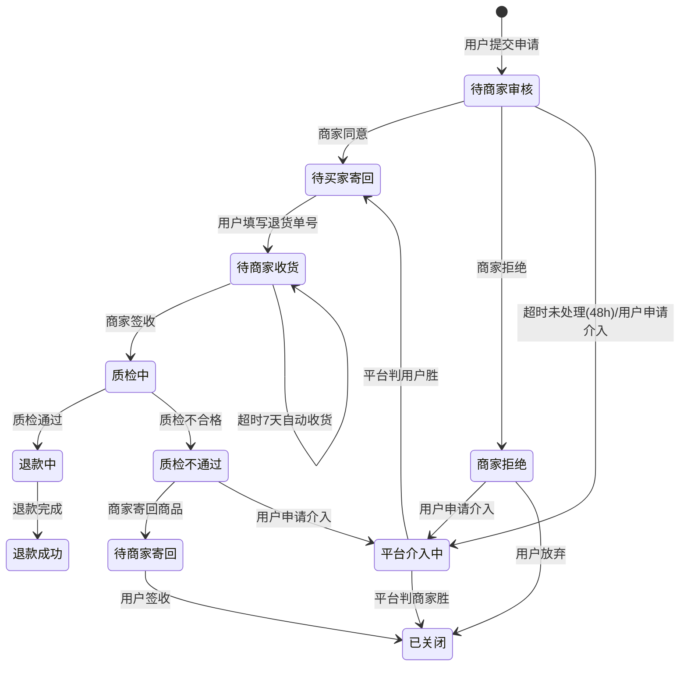

# 08 售后 / 退货：积分、优惠券与库存恢复

## 1. 售后类型

| 类型 | 适用场景 | 是否退货 | 库存处理 |
|---|---|---|---|
| **仅退款** (REFUND_ONLY) | 未发货 / 已发货但用户不想要了 / 缺货 | ❌ | 未发货：直接回补可售库存 |
| **退货退款** (RETURN_REFUND) | 已发货且已签收，商品有问题或不想要 | ✅ | **入库质检合格后**回补 |
| **换货** (EXCHANGE) | 商品有问题但不退款 | ✅（换回） | 入库后回补 + 出库预占新商品 |
| **补寄配件** (RESEND) | 少发/损坏配件 | ❌ | 不涉及 |

## 2. 退款金额的计算（核心）

### 2.1 退款金额的构成

```
退款金额 = 商品实付金额 + 分摊运费 - 已退金额

其中：
  商品实付金额 = item_amount - item_discount - coupon_amount - promo_amount - point_amount
                （即 order_item.pay_amount，下单时算好的）
  分摊运费     = order_sub.freight_amount 按 item 金额占比分摊
```

**关键：退款金额不是"原价"，而是"实付分摊额"**。用户在 [05-promotion-engine](05-promotion-engine.md) §6 中已经理解了分摊，这里直接读取：

```sql
-- 从订单项直接读
SELECT unit_price_snap, num, item_amount,
       discount_amount, coupon_amount, promo_amount, point_amount,
       pay_amount, refunded_num, refunded_amount
FROM order_item
WHERE order_sub_no = ?;
```

### 2.2 部分退款的计算

```java
/**
 * 计算某订单项退 num 件应退的金额
 * 关键：按"件"分摊，且必须用最大余数法保证多次退款的总额不超
 */
public long calcItemRefund(OrderItem item, int refundNum, OrderSub sub) {
    // 已退的件数和金额
    int  alreadyNum    = item.getRefundedNum();
    long alreadyAmount = item.getRefundedAmount();

    if (alreadyNum + refundNum > item.getNum()) {
        throw new BusinessException(REFUND_NUM_EXCEED, "退货数量超过购买数量");
    }

    // ① 该行的"可退总额"（全部退完应该是这个数）
    long totalRefundable = item.getPayAmount() + allocateFreight(item, sub);

    // ② 最后一笔退款：直接用"总额 - 已退"，避免分摊误差
    if (alreadyNum + refundNum == item.getNum()) {
        return totalRefundable - alreadyAmount;
    }

    // ③ 非最后一笔：按件比例分摊（最大余数法）
    //    注意用 (num, refundNum) 的精确比例，不用已退金额反推
    long refundAmount = totalRefundable * refundNum / item.getNum();   // floor
    return refundAmount;
}
```

**"最后一笔用差额法"是必须的**：

```
item 总价 10.00 元（分摊后实付），3 件，分 3 次各退 1 件
按比例：floor(1000/3) = 333 分/次 → 三次 = 999 分，少 1 分
用差额法：第 1 次 333，第 2 次 333，第 3 次 = 1000 - 666 = 334 分 ✅
```

这个方法保证**无论分几次退，累计退款恰好等于应退总额**。这是退款对账能平的根本。

### 2.3 运费退款规则

| 场景 | 运费处理 |
|---|---|
| 未发货·整单退 | 退全部运费 |
| 未发货·部分退（整个子单的商品都退了） | 退该子单运费 |
| 未发货·部分退（子单还有商品没退） | **不退运费** |
| 已发货·整单退货 | 退运费（发货运费），退货运费由责任方承担 |
| 已发货·部分退货 | **不退运费** |
| 质量问题 | 运费全退 + 退货运费商家承担 |
| 七天无理由 | 退发货运费，退货运费用户承担 |

**"整单/部分"的判定**：以**子单**为单位，而不是母单。用户退掉子单 A 的全部商品，就退子单 A 的运费。

```java
boolean isWholeSubOrderRefund(OrderSub sub) {
    List<OrderItem> items = itemMapper.listBySub(sub.getOrderSubNo());
    return items.stream().allMatch(i ->
        i.getRefundedNum() + i.getRefundingNum() >= i.getNum());
}
```

## 3. 退货状态机

### 3.1 状态定义

```java
public enum RefundStatus {
    // 仅退款分支
    APPLYING(10, "待商家审核"),
    MERCHANT_REJECTED(11, "商家拒绝"),
    WAIT_REFUND(20, "待退款"),

    // 退货退款分支
    WAIT_RETURN(30, "待买家寄回"),
    WAIT_RECEIVE(40, "待商家收货"),
    QUALITY_CHECKING(50, "质检中"),
    QUALITY_FAILED(51, "质检不通过"),

    // 终态
    REFUNDING(60, "退款中"),
    SUCCESS(70, "退款成功"),
    CLOSED(80, "已关闭"),
    USER_REVOKED(81, "用户撤销"),
    PLATFORM_INTERVENING(90, "平台介入中");
}
```

### 3.2 退货退款完整流程



### 3.3 关键节点：库存恢复在"入库后"

**需求明确：商品恢复库存的节点是【入库后】**。

```
错误做法：用户提交退货申请 → 立即回补库存
  问题：用户可能不寄回，或寄回的是砖头。库存虚增 → 超卖。

错误做法：商家同意退货 → 回补库存
  问题：同上，商品还没回来。

正确做法：商品到仓 + 质检合格 → 回补
```

**实现**：

```
① 用户提交退货申请（refund_order.status = 待商家审核）
   → 库存不变

② 商家同意（status = 待买家寄回）
   → 库存不变

③ 用户寄回并填单号（status = 待商家收货）
   → 库存不变

④ 商家/仓库签收（status = 质检中）
   → 库存不变

⑤ 质检合格（status = 退款中）
   → ★ 触发库存回补
   → 调 inventoryClient.returnIn(skuId, num, bizKey = "RETURN:" + refundNo + ":" + skuId)
   → DB: available += n, total 不变（如果原来 total 已扣）
     实际语义：退货入库使商品重新可售
     → UPDATE sku_stock SET available = available + n WHERE sku_id=? AND warehouse_id=?
     → 写 stock_flow (change_type = 5 退货入库, biz_key 唯一索引防重)

⑥ 退款成功（status = 退款成功）
   → 资金退回
```

**质检不合格的处理**：

```java
if (qualityCheckFailed) {
    // ① 不回补库存（商品报废/需人工处理）
    // ② 标记库存为"残次品"，走单独的残次库存池
    //    UPDATE sku_stock SET defective = defective + n WHERE ...
    // ③ 通知用户，提供"商家寄回"选项
    // ④ 若用户选择不寄回，商品归用户，不退款
}
```

**残次品库存与正常库存分离**：`sku_stock` 增加 `defective` 列，不计入 `available`。残次品由运营决定：翻新后转可用、或销毁。

### 3.4 未发货退款的库存处理

未发货的"仅退款"**不走入库流程**（商品根本没出库），库存恢复更简单：

```
下单时：  available -= n, locked += n     （预占）
支付时：  locked -= n,   frozen += n      （实扣）
发货时：  frozen -= n,   total -= n       （出库）

未发货退款（在"支付后、发货前"）：
   商品还在仓库里，物理上没有离开
   → available += n, frozen -= n      （恢复到可售）
   → 写 stock_flow (change_type = 3 回补)

已发货后申请仅退款（用户收到货但选仅退款 → 实际上应该走退货退款）
   → 系统强制转为退货退款类型
```

**状态与库存的对应表**：

| 退款发起时子单状态 | 库存当前状态 | 库存处理 |
|---|---|---|
| 10 待付款 | 无预占（未支付） | 无 |
| 20 待发货（已支付未发货） | `frozen` 有值 | `available += n, frozen -= n` |
| 30 待收货 / 40 已完成 | `total` 已扣 | **等入库质检后 `available += n`** |

## 4. 优惠券的退货处理

### 4.1 规则设计

| 场景 | 券的处理 | 理由 |
|---|---|---|
| 整单退款（母单全部子单都退了） | **券退回**（`status: 3 已使用 → 1 未使用`） | 交易实际未发生，券不该被消耗 |
| 部分退款（只是子单之一） | **券不退回** | 券已经为整笔交易产生了价值，部分退是用户的选择 |
| 券在退款时已过期 | 退回但**立即置为已过期**（或退回并延长 7 天） | 两种策略，见下 |
| 换货 | 券不退回 | 交易继续 |
| 运费券 | 整单退时退回 | 运费已退，券也该退 |

**"整单"的判定**：

```java
boolean isWholeOrderRefund(String mainOrderNo) {
    // 母单下所有子单都是"已退款"状态
    List<OrderSub> subs = subMapper.listByMain(mainOrderNo);
    return subs.stream().allMatch(s -> s.getStatus() == SubOrderStatus.REFUNDED);
}
```

**退券的实现**：

```java
@Transactional
public void refundCoupon(String refundNo, String mainOrderNo) {
    if (!isWholeOrderRefund(mainOrderNo)) {
        log.info("部分退款，不退回优惠券: mainOrderNo={}", mainOrderNo);
        return;
    }

    List<CouponCode> used = couponMapper.listByOrder(mainOrderNo, CouponStatus.USED);
    for (CouponCode cc : used) {
        // ① 幂等检查：bizKey 唯一索引
        String bizKey = "REFUND:" + refundNo + ":" + cc.getId();
        if (couponFlowMapper.existsByBizKey(bizKey)) continue;

        // ② 判断是否过期
        boolean expired = cc.getValidEnd().isBefore(LocalDateTime.now());
        CouponStatus target = expired ? CouponStatus.EXPIRED : CouponStatus.UNUSED;

        // ③ 更新状态
        int rows = couponMapper.refund(cc.getId(), target, bizKey);
        if (rows == 0) continue;   // 并发下已被处理

        // ④ 若未过期，延长有效期（可选策略）
        if (!expired && nearExpire(cc)) {
            couponMapper.extendValidEnd(cc.getId(), LocalDateTime.now().plusDays(7));
        }

        // ⑤ 写流水
        couponFlowMapper.insert(new CouponFlow(cc.getId(), REFUND, bizKey));
    }
}
```

**"过期券是否延长"的策略选择**：

| 策略 | 优点 | 缺点 |
|---|---|---|
| 退回但保持原有效期（可能立即过期） | 简单，防套利 | 用户体验差（退款后券没了） |
| **退回并延长 7 天**（若原有效期 < 7 天） | 体验好 | 有套利空间（专门利用退款刷新券的有效期） |
| 退回并重置为 30 天 | 体验最好 | 套利空间大 |

**推荐**：**退回并延长至"退款完成日 + 7 天"，但仅当原券剩余有效期 < 7 天时延长，且同一张券最多延长 1 次**（用 `extend_count` 字段限制）。这样既照顾体验又限制套利。

### 4.2 券退回的 Redis 同步

券状态在 Redis 也有副本（`coupon:code:{id}`），退回时必须同步：

```lua
-- KEYS[1] = coupon:code:{codeId}
-- ARGV[1] = 新的 validEnd（毫秒时间戳）
redis.call('HSET', KEYS[1], 'status', 'UNUSED')
redis.call('HDEL', KEYS[1], 'orderNo')
redis.call('HSET', KEYS[1], 'validEnd', ARGV[1])
-- TTL 设为到 validEnd 的时间
redis.call('EXPIREAT', KEYS[1], ARGV[1] / 1000)
return 1
```

**Redis 与 DB 不一致的兜底**：券列表查询以 **DB 为准**，Redis 只是加速。若 Redis 说已用而 DB 说未使用，以 DB 为准并修正 Redis。

## 5. 积分的退货处理

### 5.1 积分账户模型

```sql
CREATE TABLE `user_points` (
  `user_id`       BIGINT      NOT NULL,
  `balance`       BIGINT      NOT NULL DEFAULT 0 COMMENT '可用积分',
  `frozen`        BIGINT      NOT NULL DEFAULT 0 COMMENT '冻结中（下单占用）',
  `total_earned`  BIGINT      NOT NULL DEFAULT 0 COMMENT '累计获得',
  `total_used`    BIGINT      NOT NULL DEFAULT 0 COMMENT '累计消耗',
  `version`       INT         NOT NULL DEFAULT 0,
  `updated_at`    DATETIME(3) NOT NULL,
  PRIMARY KEY (`user_id`)
) ENGINE=InnoDB;

CREATE TABLE `points_flow` (
  `id`          BIGINT      NOT NULL AUTO_INCREMENT,
  `user_id`     BIGINT      NOT NULL,
  `change_type` TINYINT     NOT NULL COMMENT '1下单消耗 2下单冻结 3支付后实扣 4退单返还 5购物赠送 6评价赠送 7过期 8签到 9人工调整',
  `points`      BIGINT      NOT NULL COMMENT '正数增加，负数减少',
  `balance_before` BIGINT   NOT NULL,
  `balance_after`  BIGINT   NOT NULL,
  `biz_key`     VARCHAR(64) NOT NULL COMMENT '★ 幂等键',
  `biz_no`      VARCHAR(32) DEFAULT NULL COMMENT '订单号/退款单号',
  `expire_at`   DATETIME(3) DEFAULT NULL COMMENT '该笔积分的过期时间',
  `remark`      VARCHAR(255) DEFAULT NULL,
  `created_at`  DATETIME(3) NOT NULL,
  PRIMARY KEY (`id`),
  UNIQUE KEY `uk_biz_key` (`biz_key`),
  KEY `idx_user_time` (`user_id`, `created_at`),
  KEY `idx_expire` (`expire_at`) COMMENT '过期扫描'
) ENGINE=InnoDB;
```

**恒等式**：`balance = Σ points_flow.points`（按 user_id 汇总，扣除已过期的）。这个等式是对账任务的核心校验。

### 5.2 积分在下单/支付/退货的流转

```
下单时（占用，不实扣）：
   user_points:  balance -= P, frozen += P
   points_flow:  change_type=2（冻结）, points=-P, biz_key="ORDER_FREEZE:{mainOrderNo}"

支付成功时（实扣）：
   user_points:  frozen -= P, total_used += P
   points_flow:  change_type=3（实扣）, points=0, biz_key="ORDER_USE:{mainOrderNo}"
   （balance 不变，因为下单时已扣；这里只是把 frozen 转成已消耗）

订单取消/超时（解冻）：
   user_points:  frozen -= P, balance += P
   points_flow:  change_type=4（返还）, points=+P, biz_key="ORDER_CANCEL:{mainOrderNo}"

退货退款成功（返还）：
   ★ 按比例返还：退多少商品，返还对应比例的积分
   refundPoints = mainOrder.pointUsed * refundAmount / mainOrder.payableAmount
   user_points:  balance += refundPoints
   points_flow:  change_type=4, points=+refundPoints, biz_key="REFUND:{refundNo}"
```

### 5.3 积分返还的比例计算

**关键：按金额比例返还，而不是按商品数量**。

```
母单：商品 100 元，用 1000 积分抵扣 10 元，实付 90 元
用户退掉价值 50 元的商品（占商品总额 50%）

返还积分 = 1000 * (退款的商品金额占比)
        = 1000 * 50 / 100 = 500 积分
```

**注意基数用 `total_amount`（商品原价）占比，而不是 `payable_amount`（实付）**：

```java
long refundPoints = (long) floor(
    mainOrder.getPointUsed()
    * (double) refundItemOriginalAmount / mainOrder.getTotalAmount()
);
```

用整数实现：

```java
long refundPoints = mainOrder.getPointUsed() * refundItemAmount / mainOrder.getTotalAmount();
```

**为什么用原价占比而不是实付占比**：积分的消耗是为"商品价值"付出的，退货时按商品价值的比例返还更直观。而且用原价占比，**最后一次退款时可以用差额法保证总的返还积分恰好等于消耗的积分**。

```java
// 最后一次退款用差额法
long alreadyRefundedPoints = pointsFlowMapper.sumRefundedByOrder(mainOrderNo);
long refundPoints = mainOrder.getPointUsed() - alreadyRefundedPoints;
```

**积分返还的取整规则**：**向下取整**（`floor`），保证多次返还之和 ≤ 消耗总量。最后一次用差额补齐。

### 5.4 积分有效期

```
积分获得后 N 个月过期（如 12 个月），按"先进先出"消耗。
points_flow 每条正数记录有 expire_at。
过期任务：按 expire_at 扫描，扣减余额，写 change_type=7 的负数流水。
```

**过期的顺序**：FIFO（先获得的先过期）。实现上，计算余额时按 `expire_at` 升序累加，累计到超过"已被消耗的积分"为止。

## 6. 退货与其它模块的联动总表

| 动作 | 触发时机 | 幂等键 |
|---|---|---|
| 库存回补 | **质检合格后**（已发货）/ 退款申请通过（未发货） | `RETURN:{refundNo}:{skuId}` |
| 优惠券退回 | 整单退款成功时 | `REFUND:{refundNo}:{couponCodeId}` |
| 积分返还 | 退款成功时 | `REFUND:{refundNo}` |
| 资金退款 | 退款单审核通过、质检合格后 | `REFUND_PAY:{refundNo}` |
| 商家结算冲减 | 退款成功时 | `SETTLE_REVERSE:{refundNo}` |
| 母单退款额累加 | 退款成功时 | CAS on `order_main.refunded_amount` |
| 订单项退款数量累加 | 退款成功时 | `UPDATE order_item SET refunded_num = refunded_num + ? WHERE ... AND refunded_num + ? <= num` |

**退回顺序很重要**：

```
① 先退库存（商品已入库，库存先恢复）
② 再退券/积分
③ 最后退钱
④ 更新订单状态

每一步都幂等。任何一步失败，由本地消息表重试，不影响其他步骤。
绝不出现"钱退了但库存没恢复"导致的不一致 —— 因为每一步独立重试，最终都会成功。
```

## 7. 售后的时间窗口

| 规则 | 值 | 说明 |
|---|---|---|
| 未发货随时可退 | 无限制 | 子单状态 20 且未发货 |
| 签收后 7 天无理由 | 7 天 | 从 `order_sub.receive_time` 起算 |
| 质量问题售后 | 15 天 | |
| 生鲜类目 | 24 小时 | 类目可配 |
| 商家审核时限 | 48 小时 | 超时自动同意（或平台介入） |
| 用户寄回时限 | 7 天 | 超时自动关闭 |
| 商家收货时限 | 7 天 | 超时自动确认收货 |
| 质检时限 | 48 小时 | 超时自动通过 |

**超时的统一实现**：延迟消息 + 定时扫描，与订单超时关闭同样的模式（见 [07 §7](07-order-and-split.md)）。

```java
// 所有超时动作走同一个调度器
@Scheduled(fixedDelay = 60000)
public void processTimeouts() {
    // ① 商家审核超时
    refundMapper.selectTimeout(RefundStatus.APPLYING, 48, TimeUnit.HOURS)
        .forEach(r -> refundService.autoApprove(r.getRefundNo()));
    // ② 用户未寄回
    refundMapper.selectTimeout(RefundStatus.WAIT_RETURN, 7, TimeUnit.DAYS)
        .forEach(r -> refundService.closeByTimeout(r.getRefundNo()));
    // ③ 商家未收货
    refundMapper.selectTimeout(RefundStatus.WAIT_RECEIVE, 7, TimeUnit.DAYS)
        .forEach(r -> refundService.autoReceive(r.getRefundNo()));
    // ④ 质检超时
    refundMapper.selectTimeout(RefundStatus.QUALITY_CHECKING, 48, TimeUnit.HOURS)
        .forEach(r -> refundService.autoQualityPass(r.getRefundNo()));
}
```

## 8. 防退货欺诈

退货是欺诈高发区（买真退假、空包退货、频繁退换）。

| 手段 | 说明 |
|---|---|
| 退货频率限制 | 单用户 30 天内退货超过 5 次，进入人工审核 |
| 退货率监控 | 退货率 > 80% 的账号，限制"仅退款"权限 |
| 质检留证 | 商家收货时必须上传开箱照片/视频 |
| 高风险类目 | 高价值商品（手机、数码）要求提供序列号 |
| 信用体系 | 退货记录进入用户信用分，影响后续"闪电退款"资格 |
| 资金延迟 | 高风险账号退款走"审核后 72 小时到账"，而非即时 |

**"闪电退款"的准入**：信用分 > 700 且退货率 < 10% 的用户，可以"商家未收货先退款"。这是体验与风险的平衡点。

## 9. 关键边界场景

| 场景 | 处理 |
|---|---|
| 退货数量 > 购买数量 | 拒绝（SQL 条件 `refunded_num + ? <= num` 兜底） |
| 同一订单项并发两个退款申请 | 用 `order_item.refunded_num` 的 CAS 更新拦截，第二个失败 |
| 退货运费谁承担 | 由 `refund_order.freight_bearer` 字段记录（1用户 2商家 3平台） |
| 退款金额 > 实付金额 | 拒绝。断言：`refundAmount <= order_sub.payable_amount - order_sub.refunded_amount` |
| 券已过期，退款时是否退 | 退，但保持过期状态（或延长 7 天，见 §4.1） |
| 积分已过期，退款时是否返还 | 返还，并重置有效期（因为是系统原因导致的未使用） |
| 商品入库但 SKU 已下架 | 库存照常回补到 `available`，但不对外展示（下架商品不展示库存） |
| 部分退货后剩余商品又全部退 | 运费在最后一次退还（用差额法计算） |
| 换货 | 库存：原件入库回补 + 新品出库预占。退款金额为 0，走换货单 |
| 用户撤销申请 | 子单状态回到 `source_status`，占用释放 |
| 平台介入判定用户胜诉 | 强制退款，商家承担损失，记录商家违规 |

## 10. 退款金额的守恒校验

**每一笔退款前必须校验**：

```java
long totalPayable  = sub.getPayableAmount();
long totalRefunded = sub.getRefundedAmount();
long thisRefund    = calcRefundAmount(...);

// ① 不超退
if (totalRefunded + thisRefund > totalPayable) {
    throw new BusinessException(REFUND_AMOUNT_EXCEED,
        String.format("退款金额超限: 已退 %d, 本次 %d, 应付 %d",
            totalRefunded, thisRefund, totalPayable));
}

// ② 数量守恒
long totalRefundQty = items.stream().mapToLong(OrderItem::getRefundedNum).sum();
long totalQty       = items.stream().mapToLong(OrderItem::getNum).sum();
if (totalRefundQty > totalQty) throw new IllegalStateException("退款数量超过购买数量");
```

**对账任务（每日）**：

```sql
-- ① 子单维度：退款额不超过应付额
SELECT order_sub_no, payable_amount, refunded_amount
FROM order_sub
WHERE refunded_amount > payable_amount;
-- 必须为空

-- ② 订单项维度：退款数量与退款金额都守恒
SELECT oi.id, oi.num, oi.refunded_num, oi.pay_amount, oi.refunded_amount
FROM order_item oi
WHERE oi.refunded_num > oi.num
   OR oi.refunded_amount > oi.pay_amount + 0;   -- 含运费分摊时需调整
-- 必须为空

-- ③ 母单维度：Σ子单退款 == 母单退款
SELECT m.order_main_no, m.refunded_amount, SUM(s.refunded_amount) AS sub_sum
FROM order_main m JOIN order_sub s ON m.order_main_no = s.order_main_no
GROUP BY m.order_main_no
HAVING m.refunded_amount <> sub_sum;
-- 必须为空
```

这三条 SQL 是资金安全的体检表，每天跑一次，有任何一行都是 P0 级问题。
