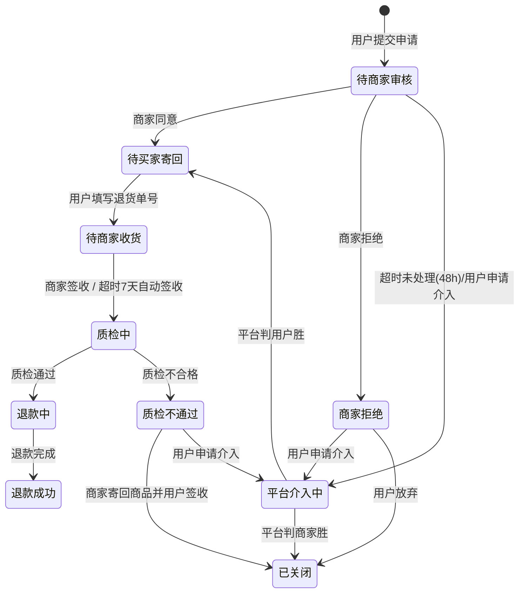

# 08 售后 / 退货：积分、优惠券与库存恢复

## 1. 售后类型

| 类型 | 适用场景 | 是否退货 | 库存处理 |
|---|---|---|---|
| **仅退款** (REFUND_ONLY) | 未发货 / 缺货 | ❌ | 未发货：直接回补可售库存 |
| **退货退款** (RETURN_REFUND) | 已发货且已签收，商品有问题或不想要 | ✅ | **入库质检合格后**回补 |
| **换货** (EXCHANGE) | 商品有问题但不退款 | ✅（换回） | 入库后回补 + 出库预占新商品（二期） |
| **补寄配件** (RESEND) | 少发/损坏配件 | ❌ | 不涉及（二期） |

## 2. 退款金额的计算（核心）

### 2.1 退款金额的构成

```
退款金额 = 商品退款金额 + 运费退款金额

其中：
  商品退款金额 = 按件分摊 order_item.pay_amount（下单时算好的实付）
  运费退款金额 = 按 §2.3 规则，以子单为单位整体退或不退
```

**商品款与运费分开记账**：`order_item.refunded_amount` 只记商品款（表上有 `CHECK (refunded_amount <= pay_amount)`），运费退款记在售后单的 `refund_freight` 上，子单的 `refunded_amount` = 商品款 + 运费之和。这样每一层的上限约束都清晰，不需要"含运费分摊时调整"的特例。

**关键：退款金额不是"原价"，而是"实付分摊额"**。分摊在 [05-promotion-engine](05-promotion-engine.md) §6 中已经完成，这里直接读取：

```sql
-- 从订单项直接读
SELECT unit_price_snap, num, item_amount,
       discount_amount, coupon_amount, promo_amount, point_amount,
       pay_amount, refunded_num, refunded_amount
FROM trade.order_item
WHERE order_sub_no = :sub_no;
```

### 2.2 部分退款的计算

```python
def calc_item_refund(item: OrderItem, refund_num: int) -> int:
    """计算某订单项退 refund_num 件应退的商品款（分，不含运费）。

    关键：按"件"分摊，最后一笔用差额法，保证多次退款总额恰好等于实付。
    """
    if refund_num <= 0 or item.refunded_num + refund_num > item.num:
        raise BizError(ErrorCode.REFUND_NUM_EXCEED, "退货数量超过购买数量")

    # ① 最后一笔退款：直接用"总额 - 已退"，消除分摊误差
    if item.refunded_num + refund_num == item.num:
        return item.pay_amount - item.refunded_amount

    # ② 非最后一笔：按件比例向下取整
    #    用 (num, refund_num) 的精确比例，不用已退金额反推
    return item.pay_amount * refund_num // item.num
```

**"最后一笔用差额法"是必须的**：

```
item 实付 10.00 元，3 件，分 3 次各退 1 件
按比例：1000 * 1 // 3 = 333 分/次 → 三次 = 999 分，少 1 分
用差额法：第 1 次 333，第 2 次 333，第 3 次 = 1000 - 666 = 334 分 ✅
```

这个方法保证**无论分几次退，累计退款恰好等于应退总额**。这是退款对账能平的根本。

### 2.3 运费退款规则

| 场景 | 运费处理 |
|---|---|
| 未发货·整个子单的商品都退了 | 退该子单全部运费 |
| 未发货·子单还有商品没退 | **不退运费** |
| 已发货·整个子单退货 | 退发货运费，退货运费由责任方承担 |
| 已发货·部分退货 | **不退运费** |
| 质量问题 | 运费全退 + 退货运费商家承担 |
| 七天无理由 | 退发货运费，退货运费用户承担 |

**"整单/部分"的判定**：以**子单**为单位，而不是母单。用户退掉子单 A 的全部商品，就退子单 A 的运费。因为是"本次退完后整个子单是否都退了"，所以运费总是在**最后一笔售后**中退还，天然不会重复退。

```python
def is_whole_sub_refund(items: list[OrderItem], applying: dict[int, int]) -> bool:
    """applying: 本次申请的 {order_item_id: 退货数量}"""
    return all(i.refunded_num + i.refunding_num + applying.get(i.id, 0) >= i.num for i in items)
```

## 3. 退货状态机

### 3.1 状态定义

```python
class RefundStatus(IntEnum):
    # 仅退款分支
    APPLYING = 10              # 待商家审核
    MERCHANT_REJECTED = 11     # 商家拒绝
    WAIT_REFUND = 20           # 待退款
    # 退货退款分支
    WAIT_RETURN = 30           # 待买家寄回
    WAIT_RECEIVE = 40          # 待商家收货
    QUALITY_CHECKING = 50      # 质检中
    QUALITY_FAILED = 51        # 质检不通过
    # 终态与特殊状态
    REFUNDING = 60             # 退款中
    SUCCESS = 70               # 退款成功
    CLOSED = 80                # 已关闭
    USER_REVOKED = 81          # 用户撤销
    PLATFORM_INTERVENING = 90  # 平台介入中
```

售后单状态机的实现方式与订单子单相同（表驱动 + `SELECT ... FOR UPDATE` + CAS，见 [07 §4.4](07-order-and-split.md)）。

### 3.2 退货退款完整流程



### 3.3 关键节点：库存恢复在"入库后"

**需求明确：商品恢复库存的节点是【入库后】**。

```
错误做法：用户提交退货申请 → 立即回补库存
  问题：用户可能不寄回，或寄回的是砖头。库存虚增 → 超卖。

错误做法：商家同意退货 → 回补库存
  问题：同上，商品还没回来。

正确做法：商品到仓 + 质检合格 → 回补
```

**实现**（第一期没有 WMS，"签收"和"质检"都由商家在后台操作）：

```
① 用户提交退货申请（status = 10 待商家审核）       → 库存不变
② 商家同意（status = 30 待买家寄回）                → 库存不变
③ 用户寄回并填单号（status = 40 待商家收货）        → 库存不变
④ 商家签收（status = 50 质检中）                    → 库存不变
⑤ 商家提交质检合格（status = 60 退款中）
   → ★ 同一事务内触发库存回补
   → inventory_service.return_in(session, items, biz_key=f"RETURN:{refund_no}:{sku_id}")
   → DB: available += n, total += n
     （发货时 total 已扣减，入库使商品重新回到账面并可售，恒等式 total = available + locked + frozen 保持）
   → 写 stock_biz_key + stock_flow (change_type = 5 退货入库)
   → 事务提交后通过 outbox 回补 Redis 库存
⑥ 退款成功（status = 70 退款成功）                  → 资金退回
```

**质检不合格的处理**：

```python
if quality_result is QualityResult.FAILED:
    # ① 不回补可售库存（商品报废/需人工处理）
    # ② 记入残次品库存池：
    #    UPDATE inventory.sku_stock SET defective = defective + :n WHERE ...
    # ③ 站内信通知用户，提供"商家寄回"选项
    # ④ 若用户选择不寄回，商品归用户，不退款
    ...
```

**残次品库存与正常库存分离**：`sku_stock` 增加 `defective INT NOT NULL DEFAULT 0 CHECK (defective >= 0)` 列，**不计入 `total` 恒等式**，也不计入 `available`。残次品由运营决定：翻新后转可用（`defective -= n, available += n, total += n`）、或销毁（`defective -= n`）。

### 3.4 未发货退款的库存处理

未发货的"仅退款"**不走入库流程**（商品根本没出库），库存恢复更简单：

```
下单时：  available -= n, locked += n     （预占）
支付时：  locked -= n,   frozen += n      （实扣）
发货时：  frozen -= n,   total -= n       （出库）

未发货退款（在"支付后、发货前"）：
   商品还在仓库里，物理上没有离开
   → available += n, frozen -= n      （恢复到可售，total 不变）
   → 写 stock_flow (change_type = 3 回补)

已发货后申请仅退款（用户收到货但选仅退款 → 实际上应该走退货退款）
   → 系统强制转为退货退款类型
```

**状态与库存的对应表**：

| 退款发起时子单状态 | 库存当前状态 | 库存处理 |
|---|---|---|
| 10 待付款 | 只有预占 | 不走售后，走取消订单（[07 §7.3](07-order-and-split.md)） |
| 20 待发货（已支付未发货） | `frozen` 有值 | `available += n, frozen -= n` |
| 30 待收货 / 40 已完成 | `total` 已扣 | **等入库质检后 `available += n, total += n`** |

## 4. 优惠券的退货处理

### 4.1 规则设计

| 场景 | 券的处理 | 理由 |
|---|---|---|
| 整单退款（母单全部子单都退了） | **券退回**（`status: 3 已使用 → 1 未使用`） | 交易实际未发生，券不该被消耗 |
| 部分退款（只是子单之一） | **券不退回** | 券已经为整笔交易产生了价值，部分退是用户的选择 |
| 券在退款时已过期 | 退回并按策略延长（见下） | |
| 换货 | 券不退回 | 交易继续 |
| 运费券 | 整单退时退回 | 运费已退，券也该退 |

**"整单"的判定**：在把当前子单置为"已退款"之后、同一事务内判断：

```python
async def is_whole_order_refunded(session: AsyncSession, order_main_no: str) -> bool:
    # 母单下所有子单都是"已退款"状态
    statuses = (await session.scalars(
        select(OrderSub.status).where(OrderSub.order_main_no == order_main_no)
    )).all()
    return all(s == SubOrderStatus.REFUNDED for s in statuses)
```

**退券的实现**：

```python
async def refund_coupons(session: AsyncSession, refund_no: str, order_main_no: str) -> None:
    """在退款成功的事务内调用。"""
    if not await is_whole_order_refunded(session, order_main_no):
        logger.info("部分退款，不退回优惠券", order_main_no=order_main_no)
        return

    used = await coupon_repo.list_by_order(session, order_main_no, CouponStatus.USED)
    now = datetime.now(UTC)
    for cc in used:
        # ① 幂等：biz_key 主键冲突即说明处理过
        biz_key = f"REFUND:{refund_no}:{cc.id}"
        if not await coupon_repo.try_insert_flow(session, cc.id, CouponFlowType.REFUND, biz_key):
            continue

        # ② 新的有效期：剩余不足 7 天且未延长过 → 延长到 now + 7 天（见下方策略）
        new_valid_end = cc.valid_end
        if cc.valid_end - now < timedelta(days=7) and cc.extend_count == 0:
            new_valid_end = now + timedelta(days=7)

        # ③ CAS 更新状态（status = 3 才能退回）
        await session.execute(
            update(CouponCode)
            .where(CouponCode.id == cc.id, CouponCode.status == CouponStatus.USED)
            .values(status=CouponStatus.UNUSED, used_order_no=None, used_at=None,
                    valid_end=new_valid_end,
                    extend_count=CouponCode.extend_count + (1 if new_valid_end != cc.valid_end else 0))
        )

    # ④ Redis 副本同步走 outbox（见 §4.2）
    await outbox.add(session, topic="coupon.redis_sync", biz_key=f"REFUND:{refund_no}",
                     payload={"orderMainNo": order_main_no})
```

**"过期券是否延长"的策略选择**：

| 策略 | 优点 | 缺点 |
|---|---|---|
| 退回但保持原有效期（可能立即过期） | 简单，防套利 | 用户体验差（退款后券没了） |
| **退回并延长 7 天**（若原有效期 < 7 天） | 体验好 | 有套利空间（专门利用退款刷新券的有效期） |
| 退回并重置为 30 天 | 体验最好 | 套利空间大 |

**采用**：**退回并延长至"退款完成日 + 7 天"，仅当原券剩余有效期 < 7 天时延长，且同一张券最多延长 1 次**（`coupon_code.extend_count SMALLINT NOT NULL DEFAULT 0` 字段限制）。既照顾体验又限制套利。

### 4.2 券退回的 Redis 同步

券状态在 Redis 也有副本（`coupon:code:{id}`），退回时必须同步：

```lua
-- KEYS[1] = coupon:code:{codeId}
-- ARGV[1] = 新的 validEnd（秒级时间戳）
redis.call('HSET', KEYS[1], 'status', 'UNUSED', 'validEnd', ARGV[1])
redis.call('HDEL', KEYS[1], 'orderNo')
-- TTL 设为到 validEnd 的时间
redis.call('EXPIREAT', KEYS[1], tonumber(ARGV[1]))
return 1
```

**Redis 与 DB 不一致的兜底**：券列表查询以 **DB 为准**，Redis 只是加速。若 Redis 说已用而 DB 说未使用，以 DB 为准并修正 Redis。

## 5. 积分的退货处理

### 5.1 积分账户模型

```sql
CREATE TABLE account.user_points (
  user_id       BIGINT  PRIMARY KEY,
  balance       BIGINT  NOT NULL DEFAULT 0,   -- 可用积分
  frozen        BIGINT  NOT NULL DEFAULT 0,   -- 冻结中（下单占用）
  total_earned  BIGINT  NOT NULL DEFAULT 0,   -- 累计获得
  total_used    BIGINT  NOT NULL DEFAULT 0,   -- 累计消耗
  version       INT     NOT NULL DEFAULT 0,
  updated_at    TIMESTAMPTZ(3) NOT NULL DEFAULT now(),
  CONSTRAINT ck_points_non_negative CHECK (balance >= 0 AND frozen >= 0)
);

-- 幂等键与流水分离（流水按月分区，原因同 03 §8）
CREATE TABLE account.points_biz_key (
  biz_key     VARCHAR(64) PRIMARY KEY,
  created_at  TIMESTAMPTZ(3) NOT NULL DEFAULT now()
);

CREATE TABLE account.points_flow (
  id             BIGINT GENERATED ALWAYS AS IDENTITY,
  user_id        BIGINT      NOT NULL,
  change_type    SMALLINT    NOT NULL,   -- 1下单消耗 2下单冻结 3支付后实扣 4退单返还 5购物赠送 6评价赠送 7过期 8签到 9人工调整
  points         BIGINT      NOT NULL,   -- 正数增加，负数减少
  balance_before BIGINT      NOT NULL,
  balance_after  BIGINT      NOT NULL,
  biz_key        VARCHAR(64) NOT NULL,
  biz_no         VARCHAR(32),            -- 订单号/售后单号
  expire_at      TIMESTAMPTZ(3),         -- 该笔积分的过期时间
  remark         VARCHAR(255),
  created_at     TIMESTAMPTZ(3) NOT NULL DEFAULT now(),
  PRIMARY KEY (id, created_at)
) PARTITION BY RANGE (created_at);
CREATE INDEX idx_points_flow_user_time ON account.points_flow (user_id, created_at);
CREATE INDEX idx_points_flow_expire    ON account.points_flow (expire_at) WHERE points > 0;
```

> `user` 是 PostgreSQL 保留字，作为 schema 名必须到处加双引号。因此用户模块（代码包名仍为 `user`）的 schema 命名为 `account`，见 [13](13-schema.md) §0。

**恒等式**：`balance = Σ points_flow.points`（按 user_id 汇总，扣除已过期的）。这个等式是对账任务的核心校验。

### 5.2 积分在下单/支付/退货的流转

```
下单时（占用，不实扣）：
   user_points:  balance -= P, frozen += P
   points_flow:  change_type=2（冻结）, points=-P, biz_key="ORDER_FREEZE:{mainOrderNo}"

支付成功时（实扣）：
   user_points:  frozen -= P, total_used += P
   points_flow:  change_type=3（实扣）, points=0, biz_key="ORDER_USE:{mainOrderNo}"
   （balance 不变，因为下单时已扣；这里只是把 frozen 转成已消耗）

订单取消/超时（解冻）：
   user_points:  frozen -= P, balance += P
   points_flow:  change_type=4（返还）, points=+P, biz_key="ORDER_CANCEL:{mainOrderNo}"

退货退款成功（返还）：
   ★ 按比例返还：退多少商品，返还对应比例的积分（见 §5.3）
   user_points:  balance += refund_points
   points_flow:  change_type=4, points=+refund_points, biz_key="REFUND:{refundNo}"
```

每一步都是"先插 `points_biz_key`（`ON CONFLICT DO NOTHING`），rowcount = 1 才更新账户并写流水"，与库存的幂等方式一致。

### 5.3 积分返还的比例计算

**关键：按金额比例返还，而不是按商品数量**。

```
母单：商品 100 元，用 1000 积分抵扣 10 元，实付 90 元
用户退掉价值 50 元的商品（占商品总额 50%）

返还积分 = 1000 * (退款的商品原价占比)
        = 1000 * 50 / 100 = 500 积分
```

**基数用 `total_amount`（商品原价）占比，而不是 `payable_amount`（实付）**，用整数向下取整，最后一次退款用差额法补齐：

```python
async def calc_refund_points(session: AsyncSession, main: OrderMain,
                             refund_item_original_amount: int, is_last_refund: bool) -> int:
    if main.point_used == 0:
        return 0
    if is_last_refund:
        # 最后一次退款用差额法：返还总量恰好等于消耗总量
        already = await points_repo.sum_refunded_by_order(session, main.order_main_no)
        return main.point_used - already
    # 非最后一次：向下取整，保证多次返还之和 ≤ 消耗总量
    return main.point_used * refund_item_original_amount // main.total_amount
```

**为什么用原价占比而不是实付占比**：积分的消耗是为"商品价值"付出的，退货时按商品价值的比例返还更直观；并且原价是不变的历史事实，配合差额法能保证总返还积分恰好等于消耗的积分。

### 5.4 积分有效期

```
积分获得后 N 个月过期（如 12 个月），按"先进先出"消耗。
points_flow 每条正数记录有 expire_at。
过期任务（ARQ cron，每日凌晨）：按 expire_at 扫描，扣减余额，写 change_type=7 的负数流水。
```

**过期的顺序**：FIFO（先获得的先过期）。实现上，计算余额时按 `expire_at` 升序累加，累计到超过"已被消耗的积分"为止。

## 6. 退货与其它模块的联动总表

| 动作 | 触发时机 | 幂等键 |
|---|---|---|
| 库存回补 | **质检合格后**（已发货）/ 退款申请通过（未发货） | `RETURN:{refundNo}:{skuId}` |
| 优惠券退回 | 整单退款成功时 | `REFUND:{refundNo}:{couponCodeId}` |
| 积分返还 | 退款成功时 | `REFUND:{refundNo}` |
| 资金退款 | 售后单进入"退款中" | `REFUND_PAY:{refundNo}` |
| 商家结算冲减 | 退款成功时 | `SETTLE_REVERSE:{refundNo}` |
| 母单退款额累加 | 退款成功时 | 条件更新 `refunded_amount + :amt <= paid_amount` + CHECK 约束 |
| 订单项退款数量累加 | 退款成功时 | `UPDATE trade.order_item SET refunded_num = refunded_num + :n WHERE id = :id AND refunded_num + :n <= num` |

**执行顺序与事务边界**：

```
事务 A（质检合格）：
  ① 库存回补（DB）
  ② 售后单 50 → 60，写 outbox: payment.refund_request
  —— 提交 ——
  outbox 投递 → payment 模块调用支付渠道退款（第一期为模拟渠道）

事务 B（渠道退款成功回调）：
  ③ 退券 / 退积分（仅整单时退券）
  ④ 累加订单项、子单、母单的退款额
  ⑤ 售后单 60 → 70，子单 60 → 70（同事务，见 07 §12）
  ⑥ 写 outbox：Redis 库存回补、Redis 券同步、站内信、结算冲减
  —— 提交 ——
```

**为什么资金退款单独一个事务**：调用支付渠道是外部网络请求，不能放进数据库事务里（事务会因为等待网络而长时间持锁）。通过 outbox 解耦后，渠道退款失败只会重试，不会回滚已完成的库存回补；渠道回调按 `REFUND_PAY:{refundNo}` 幂等（见 [09](09-payment.md)）。

## 7. 售后的时间窗口

| 规则 | 值 | 说明 |
|---|---|---|
| 未发货随时可退 | 无限制 | 子单状态 20 且未发货 |
| 签收后 7 天无理由 | 7 天 | 从 `order_sub.receive_time` 起算 |
| 质量问题售后 | 15 天 | |
| 生鲜类目 | 24 小时 | 类目可配 |
| 商家审核时限 | 48 小时 | 超时转平台介入 |
| 用户寄回时限 | 7 天 | 超时自动关闭 |
| 商家收货时限 | 7 天 | 超时自动签收 |
| 质检时限 | 48 小时 | 超时自动通过 |

**超时的统一实现**：售后单上的 `deadline` 字段记录"当前环节的截止时间"（见 [13 §3](13-schema.md)），一个 ARQ cron 任务按 `(status, deadline)` 扫描处理所有环节：

```python
TIMEOUT_ACTIONS: dict[RefundStatus, Callable[[AsyncSession, str], Awaitable[None]]] = {
    RefundStatus.APPLYING: refund_service.escalate_to_platform,     # 商家审核超时 → 平台介入
    RefundStatus.WAIT_RETURN: refund_service.close_by_timeout,       # 用户未寄回 → 关闭
    RefundStatus.WAIT_RECEIVE: refund_service.auto_receive,          # 商家未收货 → 自动签收
    RefundStatus.QUALITY_CHECKING: refund_service.auto_quality_pass, # 质检超时 → 自动通过
}

# ARQ cron：每分钟
async def process_refund_timeouts(ctx: dict) -> None:
    for status, action in TIMEOUT_ACTIONS.items():
        async with ctx["session_factory"]() as session:
            due = (await session.scalars(
                select(RefundOrder.refund_no)
                .where(RefundOrder.status == status, RefundOrder.deadline < func.now())
                .limit(200)
            )).all()
        for refund_no in due:
            async with ctx["session_factory"]() as session, session.begin():
                await action(session, refund_no)      # 内部走状态机 CAS，重复执行无副作用
```

## 8. 防退货欺诈

退货是欺诈高发区（买真退假、空包退货、频繁退换）。

| 手段 | 说明 |
|---|---|
| 退货频率限制 | 单用户 30 天内退货超过 5 次，进入人工审核 |
| 退货率监控 | 退货率 > 80% 的账号，限制"仅退款"权限 |
| 质检留证 | 商家收货时必须上传开箱照片（第一期存本地卷，见 [16](16-deployment.md)） |
| 高风险类目 | 高价值商品（手机、数码）要求提供序列号 |
| 信用体系 | 退货记录进入用户信用分，影响后续"闪电退款"资格 |
| 资金延迟 | 高风险账号退款走"审核后 72 小时到账"，而非即时 |

**"闪电退款"的准入**：信用分 > 700 且退货率 < 10% 的用户，可以"商家未收货先退款"。这是体验与风险的平衡点（二期）。

## 9. 关键边界场景

| 场景 | 处理 |
|---|---|
| 退货数量 > 购买数量 | 拒绝（SQL 条件 `refunded_num + :n <= num` + CHECK 约束兜底） |
| 同一订单项并发两个退款申请 | 申请时对 `order_item` 行加 `FOR UPDATE` 并累加 `refunding_num`，第二个申请看到可退数量不足而失败 |
| 退货运费谁承担 | 由 `refund_order.freight_bearer` 字段记录（1用户 2商家 3平台） |
| 退款金额 > 实付金额 | 拒绝。检查：`refund_amount + refund_freight <= order_sub.payable_amount - order_sub.refunded_amount`，另有 CHECK 约束兜底 |
| 券已过期，退款时是否退 | 退，并按 §4.1 策略延长 |
| 积分已过期，退款时是否返还 | 返还，并重置有效期（因为是系统原因导致的未使用） |
| 商品入库但 SKU 已下架 | 库存照常回补到 `available`，但不对外展示（下架商品不展示库存） |
| 部分退货后剩余商品又全部退 | 运费在最后一次退还（§2.3），商品款用差额法（§2.2） |
| 换货 | 二期。库存：原件入库回补 + 新品出库预占，退款金额为 0 |
| 用户撤销申请 | 子单状态回到 `source_status`，释放 `refunding_num` |
| 平台介入判定用户胜诉 | 强制退款，商家承担损失，记录商家违规 |

`order_item` 需要配合增加 `refunding_num INT NOT NULL DEFAULT 0` 列（申请中、尚未退款完成的数量），并把约束改为 `CHECK (refunded_num + refunding_num <= num)`。

## 10. 退款金额的守恒校验

**每一笔退款前必须校验**（显式抛异常，不用 `assert`）：

```python
def check_refund_limits(sub: OrderSub, items: list[OrderItem], this_refund: int) -> None:
    # ① 不超退
    if sub.refunded_amount + this_refund > sub.payable_amount:
        raise BizError(
            ErrorCode.REFUND_AMOUNT_EXCEED,
            f"退款金额超限: 已退 {sub.refunded_amount}, 本次 {this_refund}, 应付 {sub.payable_amount}",
        )
    # ② 数量守恒
    if any(i.refunded_num + i.refunding_num > i.num for i in items):
        raise PriceInvariantError("退款数量超过购买数量")
```

**对账任务（每日，ARQ cron）**：

```sql
-- ① 子单维度：退款额不超过应付额（CHECK 约束已保证，这里做监控）
SELECT order_sub_no, payable_amount, refunded_amount
FROM trade.order_sub
WHERE refunded_amount > payable_amount;
-- 必须为空

-- ② 订单项维度：退款数量与商品款都守恒（运费单独记在售后单上）
SELECT id, num, refunded_num, pay_amount, refunded_amount
FROM trade.order_item
WHERE refunded_num > num OR refunded_amount > pay_amount;
-- 必须为空

-- ③ 子单退款额 = Σ 订单项商品款 + Σ 已成功售后单的运费
SELECT s.order_sub_no, s.refunded_amount,
       (SELECT COALESCE(SUM(refunded_amount), 0) FROM trade.order_item i
         WHERE i.order_sub_no = s.order_sub_no)
     + (SELECT COALESCE(SUM(refund_freight), 0) FROM aftersale.refund_order r
         WHERE r.order_sub_no = s.order_sub_no AND r.status = 70) AS calc
FROM trade.order_sub s
WHERE s.refunded_amount > 0
  AND s.refunded_amount <> (SELECT COALESCE(SUM(refunded_amount), 0) FROM trade.order_item i
                             WHERE i.order_sub_no = s.order_sub_no)
                         + (SELECT COALESCE(SUM(refund_freight), 0) FROM aftersale.refund_order r
                             WHERE r.order_sub_no = s.order_sub_no AND r.status = 70);
-- 必须为空

-- ④ 母单维度：Σ 子单退款 == 母单退款
SELECT m.order_main_no, m.refunded_amount, SUM(s.refunded_amount) AS sub_sum
FROM trade.order_main m JOIN trade.order_sub s ON m.order_main_no = s.order_main_no
GROUP BY m.order_main_no, m.refunded_amount
HAVING m.refunded_amount <> SUM(s.refunded_amount);
-- 必须为空
```

这几条 SQL 是资金安全的体检表，每天跑一次，有任何一行都是 P0 级问题（第一期告警方式：写入 `ops.alert` 表并在运营后台首页红色提示，二期接企业微信机器人）。
